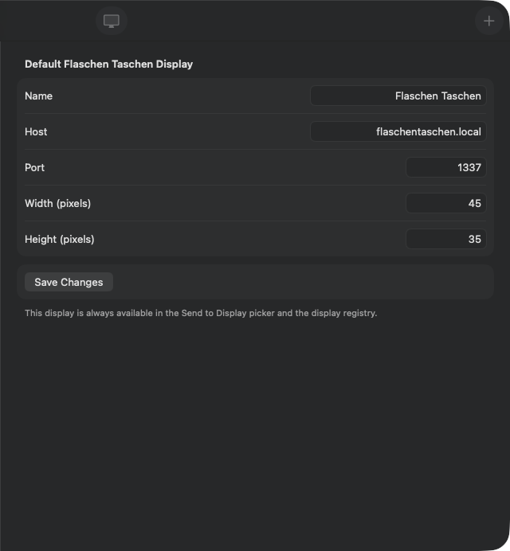

# 0021 — Add a default Flaschen Taschen display in Settings so Send to FT always has a target

| | |
|---|---|
| **Status** | resolved |
| **Module** | App / UI / Persistence |
| **Platform** | All |
| **First seen** | 2026-07-03 |
| **Closed** | 2026-07-06 |
| **Commit** | d0fdfb1 |

## Description

There's no way to configure a default Flaschen Taschen display, and when no displays have been discovered or added, the "Send to Display" section on the variant screen is empty — so the user can't send anything. Add a **Settings** surface that defines a default FT (hostname `flaschentaschen.local`, geometry `45×35`) so at least one display is always listed when the Send to FT button is pressed.

## Expected behavior

- Settings exposes a default Flaschen Taschen display with:
  - **Hostname**: `flaschentaschen.local`
  - **Geometry**: `45×35` (width 45, height 35)
  - **Port**: `1337` (standard FT port)
- The default display is available in the "Send to Display" picker (and the registry) without the user having to add one manually — i.e. `VariantDetailView`'s send section is no longer empty out of the box.
- The values are editable in Settings (the user can change the default host/geometry/port).

## Platform differences

This should be implemented idiomatically per platform:
- **macOS**: a `Settings` scene (the standard app menu **Pixel Art Gallery ▸ Settings…**, ⌘,) with a form for the default FT.
- **iOS**: an in-app Settings screen (e.g. reachable from the gallery toolbar), and/or registered defaults surfaced in the system Settings app via a `Settings.bundle`. Decide which during implementation; an in-app screen is likely simplest and consistent with the rest of the UI.

Shared model/persistence underneath both, differing only in how Settings is presented.

## Notes

- Model: `PixelArtGalleryKit/Sources/PixelArtGalleryKit/Models/FlaschenTaschenDisplay.swift` — has `host`, `port`, `displayWidth`, `displayHeight`, `source` ("mdns"/"manual"; consider a `"default"` source for the seeded one), and `endpoint`/`resolution` helpers.
- Where it surfaces: `VariantDetailView.swift:157` shows the "No displays yet" empty state; the send picker `@Query`s `FlaschenTaschenDisplay`. `DisplayRegistryView` lists/manages displays; `GalleryCoordinator.addManualDisplay(...)` is the existing insert path.
- App entry `PixelArtGallery/PixelArtGalleryApp.swift` (the `WindowGroup` + `ModelContainer`) is where a macOS `Settings` scene would be added and where a default could be seeded on first launch if none exists.
- Open question for implementation: seed the default as a real persisted `FlaschenTaschenDisplay` on first launch, vs. keep it as a configurable "default" in `@AppStorage`/`UserDefaults` that's materialized into the picker. Seeding a persisted row is simplest for making it appear in both the registry and the picker.
- Depends on the FT send path (#0012) and registry (#0011), both already resolved.

## Attachments

## Root cause

Feature gap: nothing ever created a `FlaschenTaschenDisplay` record except mDNS discovery or manual entry, so a fresh install had an empty registry and `VariantDetailView`'s "Send to Display" section showed only the "No displays yet" empty state. There was also no Settings surface anywhere in the app to define or edit a default display.

## Fix

- **Seeding** (`GalleryCoordinator.seedDefaultDisplayIfNeeded()`): inserts `FlaschenTaschenDisplay.makeDefault()` — host `flaschentaschen.local`, port `1337`, 45×35, name "Flaschen Taschen", `source == "default"` — and saves. Called from `GalleryListView.onAppear` right after `configure(modelContext:)`.
- **Seeding rule chosen**: seed only when the registry is **completely empty** at the time of the call. This is inherently idempotent (once seeded, the registry is non-empty, so repeated `onAppear` calls are no-ops), it never duplicates the default, and it respects a user who deleted the default while keeping other displays — the default only comes back once the registry has gone back to empty (or via the explicit "Restore Default Display" button in Settings). This was preferred over "seed whenever no `source == "default"` row exists" because that rule would resurrect the default on every launch after the user deliberately deleted it.
- **Settings UI**: new public `SettingsView` in PixelArtGalleryKit — a `.formStyle(.grouped)` form (per the #0024 macOS form rule, with an `#if os(macOS)` min frame) that `@Query`s the `source == "default"` record and edits its name/host/port/width/height. Field text is validated through the existing unit-tested `ManualDisplayInput` before being written back and saved. If the default record was deleted, Settings shows a "Restore Default Display" button instead.
- **macOS**: `Settings` scene in `PixelArtGalleryApp` (Pixel Art Gallery ▸ Settings…, ⌘,) presenting `SettingsView`, with its own `.modelContainer(modelContainer)` since scenes don't inherit it.
- **iOS**: gear toolbar item (`secondaryAction`) in `GalleryListView` presenting `SettingsView` in a sheet wrapped in a `NavigationStack` with a Done button. The gear is iOS-only; macOS uses the Settings scene.
- `DisplayRegistryView` rows now label `source == "default"` as "Default" (alongside "Discovered"/"Manual"), and the seeded row shows up in the registry and the `VariantDetailView` send picker automatically via their existing `@Query`s.

## Verification

- `cd PixelArtGalleryKit && swift test` — 76 tests executed, 0 failures (up from 73). New tests: `testSeedDefaultDisplayWhenRegistryIsEmpty`, `testSeedDefaultDisplayIsIdempotent`, `testSeedDefaultDisplaySkipsWhenAnyDisplayExists` (in `GalleryCoordinatorTests`).
- `xcodebuild -project PixelArtGallery.xcodeproj -scheme PixelArtGallery -destination 'platform=macOS' CODE_SIGNING_ALLOWED=NO build` — BUILD SUCCEEDED.
- `xcodebuild -project PixelArtGallery.xcodeproj -scheme PixelArtGallery -destination 'platform=iOS Simulator,name=iPhone 17 Pro' CODE_SIGNING_ALLOWED=NO build` — BUILD SUCCEEDED.
- Visual: built a temporary `SettingsHarness` executable target in the PixelArtGalleryKit package (`swift build --product SettingsHarness`) with an in-memory `ModelContainer` (GalleryItem/Variant/FlaschenTaschenDisplay schema) presenting `GalleryListView` (whose `onAppear` performs the seeding against the empty registry) side by side with `SettingsView`. Captured the window with `screencapture -l <windowID>`: the Settings form renders "Default Flaschen Taschen Display" with Name "Flaschen Taschen", Host "flaschentaschen.local", Port 1337, Width 45, Height 35, a Save Changes button, and the footer note — proving the empty-registry seed and the Settings query/edit surface end to end. Cropped shot attached as `0021/settings-macos.png`. The harness target and source were removed afterward (`git status` clean of them).

## Files changed

- `PixelArtGalleryKit/Sources/PixelArtGalleryKit/Models/FlaschenTaschenDisplay.swift` — `defaultSource` constant, `makeDefault()` factory, doc updates for the "default" source value.
- `PixelArtGalleryKit/Sources/PixelArtGalleryKit/ViewModels/GalleryCoordinator.swift` — `seedDefaultDisplayIfNeeded()` (seed-when-empty rule, logged, non-throwing).
- `PixelArtGalleryKit/Sources/PixelArtGalleryKit/UI/SettingsView.swift` — new public shared Settings surface (grouped form, ManualDisplayInput validation, restore path).
- `PixelArtGalleryKit/Sources/PixelArtGalleryKit/UI/GalleryListView.swift` — seeding call in `onAppear`; iOS-only gear toolbar item + Settings sheet.
- `PixelArtGalleryKit/Sources/PixelArtGalleryKit/UI/DisplayRegistryView.swift` — "Default" source label on registry rows.
- `PixelArtGallery/PixelArtGalleryApp.swift` — macOS `Settings` scene with its own `.modelContainer`.
- `PixelArtGalleryKit/Tests/PixelArtGalleryKitTests/ViewModels/GalleryCoordinatorTests.swift` — three seeding tests.

## Gotchas

- The `@Query` in `SettingsView` filters on the string literal `"default"` because `#Predicate` cannot reference the `FlaschenTaschenDisplay.defaultSource` static — the two must be kept in sync (both files carry a comment).
- A macOS `Settings` scene does **not** inherit the `WindowGroup`'s model container; without its own `.modelContainer(modelContainer)` the view would crash on its `@Query`.
- `FlaschenTaschenDisplay`'s initializer is internal, so external harnesses/apps can't construct one directly — the visual harness had to seed through `GalleryListView`'s coordinator path, which conveniently is exactly the production code path.
