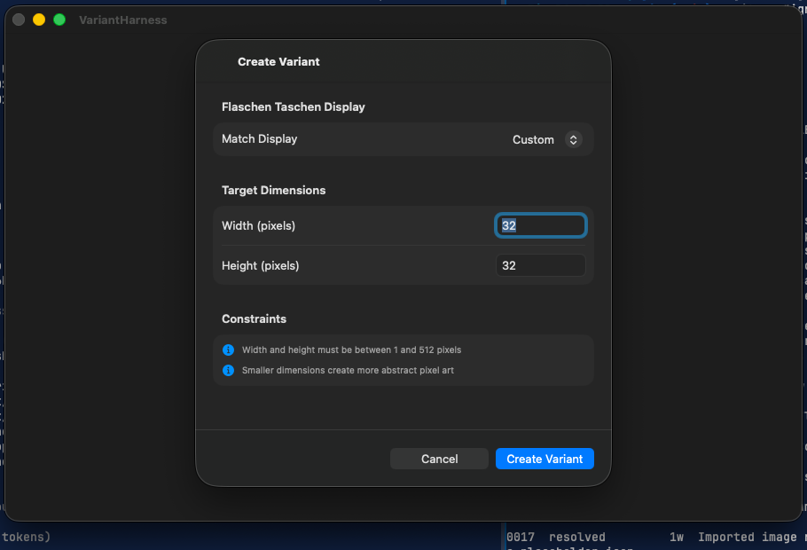

# 0024 — Create Variant sheet on macOS shows no width/height fields

| | |
|---|---|
| **Status** | resolved |
| **Module** | UI |
| **Platform** | macOS |
| **First seen** | 2026-07-06 |
| **Closed** | 2026-07-06 |
| **Commit** | 3a70cd5 |

## Description

On macOS, choosing Create Variant opens a sheet that is essentially empty: the title "Create Variant" and the Cancel / Create Variant buttons render, but none of the form content — the width/height dimension fields, the display picker, or the constraints hints — is visible. The same view on iPhone renders all fields correctly.

## Steps to reproduce

1. Run the macOS app.
2. Open a gallery item and click the + (Create Variant) toolbar button.
3. The sheet appears with a title and buttons but no visible form fields.

## Expected behavior

The sheet shows the Flaschen Taschen display picker (when displays exist), Width (pixels) and Height (pixels) fields prefilled with 32×32, and the constraints hints — matching the iPhone experience, styled natively for macOS.

## Actual behavior

The sheet body is blank; the only controls are Cancel and Create Variant. There is no way to see or set the target dimensions.

## Attachments

## Notes

- `PixelArtGalleryKit/Sources/PixelArtGalleryKit/UI/VariantCreationView.swift` — `Form` inside `NavigationStack` inside `.sheet` with no `formStyle` and no explicit frame. On macOS the default (columns) form style plus an unsized sheet renders the content collapsed/invisible.
- Likely fix: `.formStyle(.grouped)` plus an explicit `#if os(macOS)` min frame on the sheet content (the standard macOS form-sheet pattern). Diagnose empirically by running the macOS app.
- Related: #0025, #0026, #0027 — the other form sheets share the identical structure.

## Root cause

On macOS, `Form` defaults to `.formStyle(.columns)`, and the sheet content had no explicit frame. A columns-style form inside an unsized macOS sheet collapses its rows to zero height: the sheet window sizes to the `NavigationStack` chrome only (title + toolbar buttons), so the picker, dimension fields, and hint sections were laid out with no visible space. iOS was unaffected because its default form style is grouped and sheets there are full-height.

## Fix

In `VariantCreationView.swift`:

- Applied `.formStyle(.grouped)` to the `Form` (this is already the iOS default, so iOS rendering is unchanged).
- Added `#if os(macOS)` `.frame(minWidth: 440, minHeight: 440)` on the `NavigationStack` so the sheet has an explicit content size that fits all sections comfortably.
- Added `.labelsHidden()` (macOS only) to the Width/Height `TextField`s — in a grouped macOS form the field's title otherwise renders as a redundant leading label ("Width (pixels) … Width [32]") next to the row's own label.

## Verification

- `cd PixelArtGalleryKit && swift test` — 72 tests executed, 0 failures.
- `xcodebuild -project PixelArtGallery.xcodeproj -scheme PixelArtGallery -destination 'platform=macOS' CODE_SIGNING_ALLOWED=NO build` — BUILD SUCCEEDED.
- `xcodebuild -project PixelArtGallery.xcodeproj -scheme PixelArtGallery -destination 'platform=iOS Simulator,name=iPhone 17 Pro' CODE_SIGNING_ALLOWED=NO build` — BUILD SUCCEEDED.
- Visual: built a temporary `VariantHarness` executable target in the PixelArtGalleryKit package (in-memory `ModelContainer` with the `GalleryItem`/`Variant`/`FlaschenTaschenDisplay` schema plus one seeded display) that presents `VariantCreationView` in an actual `.sheet`, launched it on macOS, and captured a `screencapture` screenshot: the sheet shows the "Flaschen Taschen Display" section with the Match Display picker, "Target Dimensions" with Width/Height fields prefilled 32/32, both Constraints hints, and the Cancel / Create Variant buttons. The cropped screenshot is attached as `0024/create-variant-fixed-macos.png`. The harness target and source were removed afterward (`git status` clean of them).

## Files changed

- `PixelArtGalleryKit/Sources/PixelArtGalleryKit/UI/VariantCreationView.swift` — `.formStyle(.grouped)`, macOS-only min frame on the sheet content, macOS-only `.labelsHidden()` on the dimension text fields.

## Gotchas

- The empty rendering is caused by the combination of macOS's default columns form style and an unsized sheet — not by SwiftData `@Query` or the `NavigationStack`. The fix pattern for #0025–#0027 (identical form-sheet structure) is: `.formStyle(.grouped)` on the `Form` + `#if os(macOS)` explicit `frame(minWidth:minHeight:)` on the sheet content.
- With `.formStyle(.grouped)` on macOS, a `TextField("Title", ...)` renders its title as a leading label inside the row; add `.labelsHidden()` (macOS only) when the row already provides its own `Text` label, or the label appears twice.
