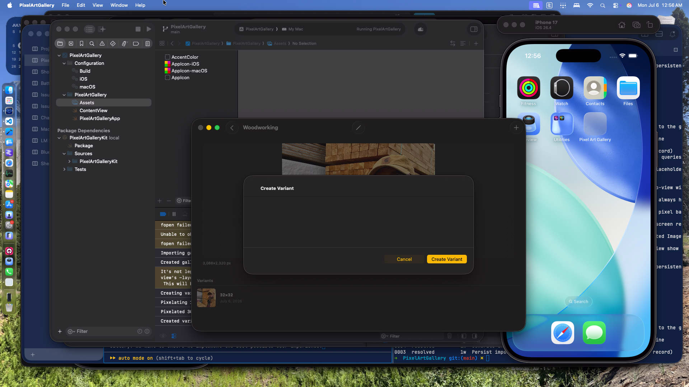

# 0024 — Create Variant sheet on macOS shows no width/height fields

| | |
|---|---|
| **Status** | open |
| **Module** | UI |
| **Platform** | macOS |
| **First seen** | 2026-07-06 |

## Description

On macOS, choosing Create Variant opens a sheet that is essentially empty: the title "Create Variant" and the Cancel / Create Variant buttons render, but none of the form content — the width/height dimension fields, the display picker, or the constraints hints — is visible. The same view on iPhone renders all fields correctly.

## Steps to reproduce

1. Run the macOS app.
2. Open a gallery item and click the + (Create Variant) toolbar button.
3. The sheet appears with a title and buttons but no visible form fields.

## Expected behavior

The sheet shows the Flaschen Taschen display picker (when displays exist), Width (pixels) and Height (pixels) fields prefilled with 32×32, and the constraints hints — matching the iPhone experience, styled natively for macOS.

## Actual behavior

The sheet body is blank; the only controls are Cancel and Create Variant. There is no way to see or set the target dimensions.

## Attachments

## Notes

- `PixelArtGalleryKit/Sources/PixelArtGalleryKit/UI/VariantCreationView.swift` — `Form` inside `NavigationStack` inside `.sheet` with no `formStyle` and no explicit frame. On macOS the default (columns) form style plus an unsized sheet renders the content collapsed/invisible.
- Likely fix: `.formStyle(.grouped)` plus an explicit `#if os(macOS)` min frame on the sheet content (the standard macOS form-sheet pattern). Diagnose empirically by running the macOS app.
- Related: #0025, #0026, #0027 — the other form sheets share the identical structure.
