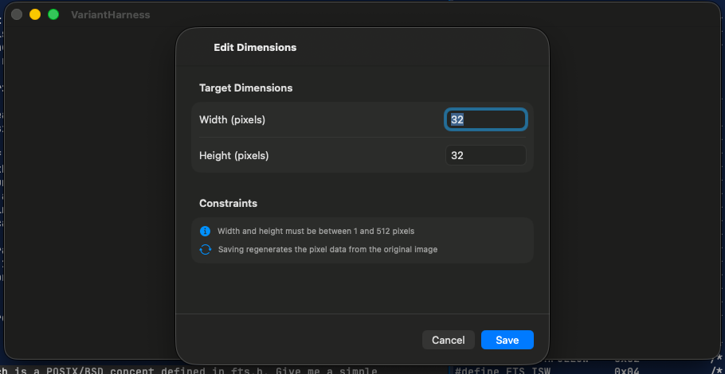

# 0025 — Edit Dimensions sheet on macOS has the same empty-form rendering as Create Variant

| | |
|---|---|
| **Status** | resolved |
| **Module** | UI |
| **Platform** | macOS |
| **First seen** | 2026-07-06 |
| **Closed** | 2026-07-06 |
| **Commit** | 37d46df |

## Description

The Edit Dimensions sheet (`VariantEditDimensionsView`) is built with the identical `NavigationStack` + unstyled `Form` structure as the Create Variant sheet (#0024), so on macOS its width/height fields and constraints hints do not render either — the sheet shows only the title and Cancel/Save buttons.

## Steps to reproduce

1. Run the macOS app and open a variant (or right-click a variant row → Edit Dimensions).
2. The Edit Dimensions sheet appears without visible width/height fields.

## Expected behavior

Width (pixels) and Height (pixels) fields prefilled with the variant's current size, plus the constraints hints, in a native macOS grouped form at a sensible sheet size.

## Actual behavior

Blank sheet body; only Cancel and Save are visible, and Save cannot meaningfully be used without seeing the fields.

## Notes

- `PixelArtGalleryKit/Sources/PixelArtGalleryKit/UI/VariantEditDimensionsView.swift`.
- Apply the same fix pattern as #0024 (`.formStyle(.grouped)` + macOS min frame) so the two dimension sheets stay visually consistent.

## Attachments

## Root cause

Identical to #0024: on macOS, `Form` defaults to `.formStyle(.columns)`, and the sheet content had no explicit frame. A columns-style form inside an unsized macOS sheet collapses its rows to zero height, so the sheet window sized to the `NavigationStack` chrome only (title + Cancel/Save) and the width/height fields and hints were laid out with no visible space. iOS was unaffected because its default form style is grouped and sheets there are full-height.

## Fix

In `VariantEditDimensionsView.swift`, following the exact pattern from #0024:

- Applied `.formStyle(.grouped)` to the `Form` (already the iOS default, so iOS rendering is unchanged).
- Added `#if os(macOS)` `.frame(minWidth: 440, minHeight: 360)` on the `NavigationStack` — same width as the fixed Create Variant sheet for visual consistency, smaller height since this sheet has no display-picker section.
- Added `.labelsHidden()` (macOS only) to the Width/Height `TextField`s so the grouped form doesn't render the field title as a duplicate leading label next to the row's own `Text` label.

## Verification

- `cd PixelArtGalleryKit && swift test` — 72 tests executed, 0 failures.
- `xcodebuild -project PixelArtGallery.xcodeproj -scheme PixelArtGallery -destination 'platform=macOS' CODE_SIGNING_ALLOWED=NO build` — BUILD SUCCEEDED.
- `xcodebuild -project PixelArtGallery.xcodeproj -scheme PixelArtGallery -destination 'platform=iOS Simulator,name=iPhone 17 Pro' CODE_SIGNING_ALLOWED=NO build` — BUILD SUCCEEDED.
- Visual: built a temporary `VariantHarness` executable target in the PixelArtGalleryKit package (no ModelContainer needed — this view has no `@Query`) presenting `VariantEditDimensionsView(width: 32, height: 32)` in an actual `.sheet`, launched it on macOS, and captured a `screencapture` screenshot: the sheet shows "Target Dimensions" with Width/Height fields prefilled 32/32 (single label per row, no duplicates), both Constraints hints, and the Cancel/Save buttons with Save enabled. Cropped screenshot attached as `0025/edit-dimensions-fixed-macos.png`. The harness target and source were removed afterward (`git status` clean of them).

## Files changed

- `PixelArtGalleryKit/Sources/PixelArtGalleryKit/UI/VariantEditDimensionsView.swift` — `.formStyle(.grouped)`, macOS-only `frame(minWidth: 440, minHeight: 360)` on the sheet content, macOS-only `.labelsHidden()` on the dimension text fields.

## Gotchas

- When rebuilding a reused harness executable, `swift build --target <name>` only compiles the module and can leave a stale linked binary in `.build/debug/`; use `swift build --product <name>` (or plain `swift build`) so the executable is actually relinked before capturing screenshots.
