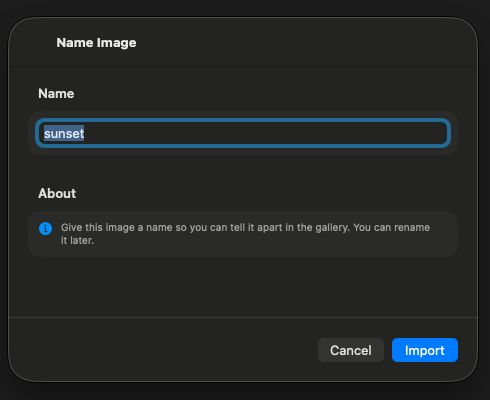

# 0026 — Name Image import sheet on macOS has the same empty-form rendering

| | |
|---|---|
| **Status** | resolved |
| **Module** | UI |
| **Platform** | macOS |
| **First seen** | 2026-07-06 |
| **Closed** | 2026-07-06 |
| **Commit** | c8ff7e9 |

## Description

The Name Image sheet (`ImportNamingView`), shown after picking an image to import, uses the identical `NavigationStack` + unstyled `Form` structure as #0024, so on macOS the name text field and the About hint do not render — the user cannot see or edit the name they are importing under.

## Steps to reproduce

1. Run the macOS app and import an image (+ toolbar button).
2. After choosing a file, the Name Image sheet appears without a visible name field.

## Expected behavior

A grouped form with the Name field (prefilled from the source filename) and the About hint, sized appropriately for macOS.

## Actual behavior

Blank sheet body with only the title and Cancel/Import buttons.

## Notes

- `PixelArtGalleryKit/Sources/PixelArtGalleryKit/UI/ImportNamingView.swift`.
- Apply the same fix pattern as #0024 (`.formStyle(.grouped)` + macOS min frame).

## Attachments

## Root cause

Identical to #0024: on macOS, `Form` defaults to `.formStyle(.columns)`, and the sheet content had no explicit frame. A columns-style form inside an unsized macOS sheet collapses its rows to zero height, so the sheet window sized to the `NavigationStack` chrome only (title + Cancel/Import) and the name field and About hint were laid out with no visible space. iOS was unaffected because its default form style is grouped and sheets there are full-height.

## Fix

In `ImportNamingView.swift`, following the exact pattern from #0024/#0025:

- Applied `.formStyle(.grouped)` to the `Form` (already the iOS default, so iOS rendering is unchanged).
- Added `#if os(macOS)` `.frame(minWidth: 440, minHeight: 300)` on the `NavigationStack` — same width as the other fixed sheets for consistency, shorter since this sheet has only the Name section and the About hint.
- Added `.labelsHidden()` (macOS only) to the name `TextField` — in a grouped macOS form the field's title otherwise renders as a leading label ("Imported Image") duplicating the Section header "Name". Passed an explicit `prompt: Text(defaultImportedImageName)` so the placeholder still appears when the field is cleared (on iOS the prompt equals the previous title-as-placeholder behavior, so nothing changes there).

## Verification

- `cd PixelArtGalleryKit && swift test` — 72 tests executed, 0 failures.
- `xcodebuild -project PixelArtGallery.xcodeproj -scheme PixelArtGallery -destination 'platform=macOS' CODE_SIGNING_ALLOWED=NO build` — BUILD SUCCEEDED.
- `xcodebuild -project PixelArtGallery.xcodeproj -scheme PixelArtGallery -destination 'platform=iOS Simulator,name=iPhone 17 Pro' CODE_SIGNING_ALLOWED=NO build` — BUILD SUCCEEDED.
- Visual: built a temporary `VariantHarness` executable target in the PixelArtGalleryKit package (no ModelContainer needed — this view has no `@Query`) presenting `ImportNamingView(suggestedName: "sunset.png") { _ in }` in an actual `.sheet`, launched it on macOS, and captured a `screencapture` screenshot: the sheet shows the "Name" section with the field prefilled "sunset" (single label, no duplicate leading label), the About hint with its info icon, and the Cancel/Import buttons. Cropped screenshot attached as `0026/name-image-fixed-macos.png`. The harness target and source were removed afterward (`git status` clean of them).

## Files changed

- `PixelArtGalleryKit/Sources/PixelArtGalleryKit/UI/ImportNamingView.swift` — `.formStyle(.grouped)`, macOS-only `frame(minWidth: 440, minHeight: 300)` on the sheet content, macOS-only `.labelsHidden()` plus an explicit prompt on the name text field.
