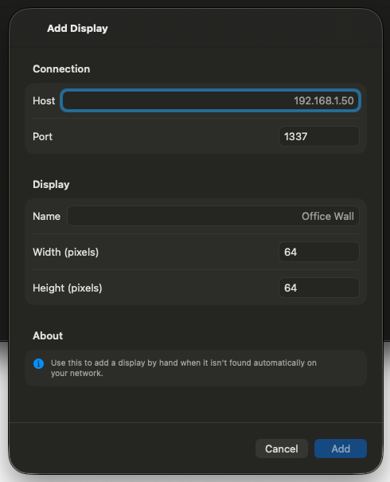

# 0027 — Add Display sheet on macOS has the same empty-form rendering

| | |
|---|---|
| **Status** | resolved |
| **Module** | UI |
| **Platform** | macOS |
| **First seen** | 2026-07-06 |
| **Closed** | 2026-07-06 |
| **Commit** | 4b6992c |

## Description

The Add Display sheet (`ManualDisplayEntryView`) — host, port, name, width, and height fields for manually registering a Flaschen Taschen display — uses the identical `NavigationStack` + unstyled `Form` structure as #0024, so on macOS none of its fields render. Manually adding a display is impossible on the Mac.

## Steps to reproduce

1. Run the macOS app, open Displays, choose + → Add Manually.
2. The Add Display sheet appears without visible fields; the Add button stays disabled because no host can be entered.

## Expected behavior

A grouped form with Connection (Host, Port), Display (Name, Width, Height), and the About hint, sized appropriately for macOS.

## Actual behavior

Blank sheet body with only the title and Cancel/Add buttons; Add is permanently disabled.

## Notes

- `PixelArtGalleryKit/Sources/PixelArtGalleryKit/UI/ManualDisplayEntryView.swift`.
- Apply the same fix pattern as #0024 (`.formStyle(.grouped)` + macOS min frame).

## Attachments

## Root cause

Identical to #0024: on macOS, `Form` defaults to `.formStyle(.columns)`, and the sheet content had no explicit frame. A columns-style form inside an unsized macOS sheet collapses its rows to zero height, so the sheet window sized to the `NavigationStack` chrome only (title + Cancel/Add) and the Host/Port/Name/Width/Height fields and About hint were laid out with no visible space. iOS was unaffected because its default form style is grouped and sheets there are full-height.

## Fix

In `ManualDisplayEntryView.swift`, following the exact pattern from #0024–#0026:

- Applied `.formStyle(.grouped)` to the `Form` (already the iOS default, so iOS rendering is unchanged).
- Added `#if os(macOS)` `.frame(minWidth: 440, minHeight: 520)` on the `NavigationStack` — same width as the other fixed sheets; this is the tallest of the form sheets (two-row Connection section, three-row Display section, optional error section, About hint), so the height is larger than the others.
- Added `.labelsHidden()` (macOS only) to all five `TextField`s (Host, Port, Name, Width, Height) — their rows already provide their own `Text` labels, so the grouped macOS style would otherwise render duplicate leading labels. Passed explicit `prompt:` texts matching the previous titles so the in-field placeholders (192.168.1.50, 1337, Office Wall, 64, 64) still appear; on iOS the prompt equals the previous title-as-placeholder behavior, so nothing changes there.

## Verification

- `cd PixelArtGalleryKit && swift test` — 72 tests executed, 0 failures (includes `ManualDisplayInputTests` covering this file's validation type).
- `xcodebuild -project PixelArtGallery.xcodeproj -scheme PixelArtGallery -destination 'platform=macOS' CODE_SIGNING_ALLOWED=NO build` — BUILD SUCCEEDED.
- `xcodebuild -project PixelArtGallery.xcodeproj -scheme PixelArtGallery -destination 'platform=iOS Simulator,name=iPhone 17 Pro' CODE_SIGNING_ALLOWED=NO build` — BUILD SUCCEEDED.
- Visual: built a temporary `VariantHarness` executable target in the PixelArtGalleryKit package (no ModelContainer needed — this view has no `@Query`) presenting `ManualDisplayEntryView(onAddDisplay: { _ in })` in an actual `.sheet`, launched it on macOS, and captured a `screencapture` screenshot of the sheet window: the sheet shows the Connection section with Host (placeholder 192.168.1.50) and Port (1337), the Display section with Name (placeholder Office Wall), Width (64), and Height (64), the About hint with its info icon, and the Cancel/Add buttons — all visible without scrolling, single label per row. Cropped screenshot attached as `0027/add-display-fixed-macos.png`. The harness target and source were removed afterward (`git status` clean of them).

## Files changed

- `PixelArtGalleryKit/Sources/PixelArtGalleryKit/UI/ManualDisplayEntryView.swift` — `.formStyle(.grouped)`, macOS-only `frame(minWidth: 440, minHeight: 520)` on the sheet content, macOS-only `.labelsHidden()` plus explicit prompts on the five text fields.

## Gotchas

- The sheet's child window appears a beat after the host window; when capturing it by window ID (`screencapture -l`), list windows again after presentation — the sheet has its own `CGWindowNumber` distinct from the host window's.
