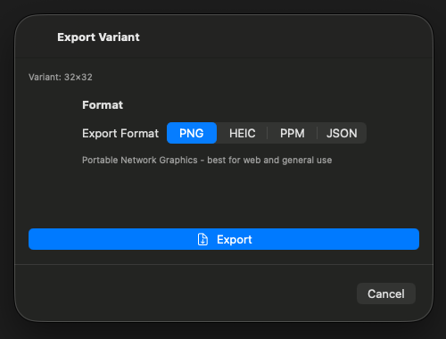

# 0028 — macOS export sheet is unsized and forces a Choose Location step before Export

| | |
|---|---|
| **Status** | resolved |
| **Module** | UI / Export |
| **Platform** | macOS |
| **First seen** | 2026-07-06 |
| **Closed** | 2026-07-06 |
| **Commit** | 2838f16 |

## Description

The Export Variant sheet (`ExportPickerView`) has two macOS problems. First, the sheet content is a plain `VStack` with a `Spacer()` and no explicit frame, so the sheet gets no reliable size on macOS. Second, the flow is un-Mac-like: the user must click "Choose Location" (which opens a save panel), come back to the sheet, and then click a separate "Export" button that stays disabled until a location was picked. On the Mac the native pattern is a single Export action that presents the save panel and writes the file on confirmation.

## Steps to reproduce

1. Run the macOS app, open a variant, click Export Variant.
2. Note the sheet sizing and that Export is disabled until Choose Location has been used.

## Expected behavior

A properly sized sheet where picking a format and clicking Export directly presents the `NSSavePanel`; confirming the panel writes the file. No separate location-picking step, no disabled primary action.

## Actual behavior

Two-step Choose Location → Export flow with a disabled Export button, in a sheet with no explicit macOS sizing.

## Notes

- `PixelArtGalleryKit/Sources/PixelArtGalleryKit/UI/ExportPickerView.swift` — `showSavePanel()` stores `selectedFileURL`; `performExport()` requires it. Collapse into one action: present the panel, then export to the chosen URL. The save panel's name field should also update when the format (extension) changes.
- Add an explicit `#if os(macOS)` frame for the sheet.

## Attachments

## Root cause

The sheet content was a plain `VStack` with a `Spacer()` and no explicit frame, so the macOS sheet window had no reliable content size. The macOS action flow was modeled on a stored location: `showSavePanel()` only stashed the panel's URL in `@State selectedFileURL`, and a separate Export button (disabled until that state was non-nil) read it back in `performExport()` — a two-step flow that is not the native macOS pattern, where the primary action itself presents the save panel.

## Fix

In `ExportPickerView.swift` (macOS only; iOS flow untouched):

- Replaced the Choose Location + Export button pair with a single prominent Export button whose action, `exportWithSavePanel()`, creates the `NSSavePanel` (allowed content type from `uniformTypeForFormat()`, suggested filename `variant-<id>.<fileExtension>`) and on `.OK` calls `performExport(format:to:)` with the panel's URL. The panel and filename are built inside the click action, so the suggested extension always reflects the format selected at the moment Export is clicked.
- The panel is presented non-blocking via `panel.beginSheetModal(for: NSApp.keyWindow)` when a key window exists, falling back to `panel.begin { }` — no `runModal()` and no `DispatchQueue.main.async` wrapper.
- `performExport(format:to:)` keeps the existing off-main-actor export path (plain fields copied out of the `@Model`, encode via `Task.detached`, `isExporting` progress state, error banner on failure).
- Removed `@State selectedFileURL`, the Save Location / "No location selected" info block, and the disabled-until-location logic.
- Added `#if os(macOS)` `.frame(minWidth: 440, minHeight: 280)` on the `NavigationStack` so the sheet has an explicit size fitting the format picker, description, and Export button.

## Verification

- `cd PixelArtGalleryKit && swift test` — 72 tests executed, 0 failures (VariantExporterTests all green).
- `xcodebuild -project PixelArtGallery.xcodeproj -scheme PixelArtGallery -destination 'platform=macOS' CODE_SIGNING_ALLOWED=NO build` — BUILD SUCCEEDED.
- `xcodebuild -project PixelArtGallery.xcodeproj -scheme PixelArtGallery -destination 'platform=iOS Simulator,name=iPhone 17 Pro' CODE_SIGNING_ALLOWED=NO build` — BUILD SUCCEEDED.
- Visual: built a temporary `VariantHarness` executable target in the PixelArtGalleryKit package (in-memory `ModelContainer` with the GalleryItem/Variant/FlaschenTaschenDisplay schema, sample 32×32 `Variant`) presenting `ExportPickerView` in an actual macOS `.sheet` (`swift build --product VariantHarness`), and captured a `screencapture` of the sheet window: properly sized sheet with the Variant 32×32 caption, Format segmented picker (PNG/HEIC/PPM/JSON) with description, a single enabled prominent Export button, and Cancel — no Choose Location button and no "No location selected" text. Cropped screenshot attached as `0028/export-sheet-fixed-macos.png`. The harness target and source were removed afterward (`git status` clean of them).
- Not exercised: the `NSSavePanel` confirmation itself. Driving the Export click via `osascript`/System Events failed with "osascript is not allowed assistive access", so the panel presentation and the write-on-OK path were verified by code review of the (unchanged) `performExport` export path plus green builds/tests, not by an interactive run.

## Files changed

- `PixelArtGalleryKit/Sources/PixelArtGalleryKit/UI/ExportPickerView.swift` — single-action macOS export via save panel, removed location-picking state/UI, macOS-only sheet frame.

## Gotchas

- `NSSavePanel.beginSheetModal(for:)` with `NSApp.keyWindow` attaches the panel to the Export sheet's own window (the sheet is key while presented), which is the desired anchoring; keep the `panel.begin` fallback for the no-key-window case.
- The suggested filename must be computed inside the button action (not cached in state) so its extension tracks the format picker; `fileExtension` is derived from `selectedFormat` at click time.
