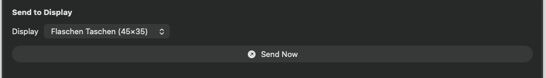

# 0032 — Send to Display picker does not auto-select the default FT display

| | |
|---|---|
| **Status** | resolved |
| **Module** | UI |
| **Platform** | All |
| **First seen** | 2026-07-06 |
| **Closed** | 2026-07-06 |
| **Commit** | a1c83d7 |

## Description

The variant screen's Send to Display picker starts with no selection even though a default Flaschen Taschen display now exists (#0021). The user has to manually open the picker and choose a display before Send Now enables — an extra step every time. The goal of this flow is to make it very easy to pick an image and send it to an FT quickly; the picker should come up pre-selected so Send Now is one tap/click away.

## Steps to reproduce

1. Launch the app fresh (the default FT display is seeded).
2. Open a gallery item → a variant.
3. In Send to Display, the picker shows no selection and Send Now is disabled until a display is chosen by hand.

## Expected behavior

When the variant screen appears, the picker is already set — preferring the default display (`source == "default"`), otherwise the first available display — and Send Now is immediately enabled.

## Actual behavior

Selection is nil on first appearance; Send Now stays disabled until the user manually picks a display.

## Notes

- `PixelArtGalleryKit/Sources/PixelArtGalleryKit/UI/VariantDetailView.swift` — `@State private var selectedDisplayID: UUID?` starts nil. The fix-up in `sendSection`'s `.onChange(of: displays.map(\.id))` only fires when the id list *changes*; it never runs for the initial value, so a screen that appears with displays already loaded gets no selection.
- Fix: initialize the selection when the view appears (e.g. `onAppear` or `.onChange(..., initial: true)`), preferring the display with `source == "default"`, falling back to the first; keep the existing fix-up for registry changes and apply the same default-first preference there.

## Attachments

## Root cause

`VariantDetailView`'s `@State private var selectedDisplayID: UUID?` starts nil, and the only code that ever assigned it (besides the picker itself) was `sendSection`'s `.onChange(of: displays.map(\.id))`. `onChange` without `initial: true` fires only when the observed value *changes* after the view is installed — the `@Query` already has the displays on first render, the id list never changes, so the fix-up never ran. Selection stayed nil and Send Now (`.disabled(isSending || selectedDisplay == nil)`) stayed disabled until the user picked a display by hand.

## Fix

- Extracted the selection rule into a unit-testable static helper `FlaschenTaschenDisplay.preferredSelection(current:among:)` operating on plain `(id: UUID, source: String)` pairs (no SwiftData needed in tests): keep `current` while it still identifies a candidate (never stomp a valid explicit user choice); otherwise prefer the candidate with `source == FlaschenTaschenDisplay.defaultSource` (the #0021 seeded default); otherwise the first candidate; `nil` when empty.
- `VariantDetailView.sendSection` now uses `.onChange(of: displays.map(\.id), initial: true)` (iOS 17+/macOS 14+, within the project's iOS 18/macOS 15 targets) and assigns `selectedDisplayID = FlaschenTaschenDisplay.preferredSelection(current:among:)` — one code path handles both the initial appearance and later registry changes.

## Verification

- `cd PixelArtGalleryKit && swift test` — 81 tests executed, 0 failures (up from 76). New `DisplayPreferredSelectionTests`: `testPrefersDefaultSourceWhenNoCurrentSelection`, `testFallsBackToFirstWhenNoDefaultSource`, `testKeepsValidExistingSelectionOverDefault`, `testReplacesStaleSelectionWithDefault`, `testReturnsNilWhenNoCandidates`.
- `xcodebuild -project PixelArtGallery.xcodeproj -scheme PixelArtGallery -destination 'platform=macOS' CODE_SIGNING_ALLOWED=NO build` — BUILD SUCCEEDED.
- `xcodebuild -project PixelArtGallery.xcodeproj -scheme PixelArtGallery -destination 'platform=iOS Simulator,name=iPhone 17 Pro' CODE_SIGNING_ALLOWED=NO build` — BUILD SUCCEEDED.
- Visual: temporary `VariantHarness` executable target in the PixelArtGalleryKit package (`swift build --product VariantHarness -Xswiftc -enable-testing`; `@testable import` for the internal view/model types), in-memory `ModelContainer` (GalleryItem/Variant/FlaschenTaschenDisplay schema). Seeded the default display via `GalleryCoordinator.seedDefaultDisplayIfNeeded()` (after `configure(modelContext:)`) plus a manual display named "Basement Panel" — deliberately sorting *before* "Flaschen Taschen" in the picker's name-sorted `@Query` — and a 32×32 sample `Variant`, presented `VariantDetailView(variant:coordinator:)` in a window and captured it with `screencapture -x -l <windowID>`. The picker shows "Flaschen Taschen (45×35)" pre-selected on first appearance (proving the default-source preference, not a first-item fallback) and Send Now renders enabled (bright label, matching the enabled Export button, unlike the grayed disabled "Size to Fit" control). Cropped shot attached as `0032/send-picker-preselected-macos.png`. Harness target and source removed afterward (`git status` clean of them); `swift test` re-run after removal, still 81/0.

## Files changed

- `PixelArtGalleryKit/Sources/PixelArtGalleryKit/Models/FlaschenTaschenDisplay.swift` — `preferredSelection(current:among:)` static helper.
- `PixelArtGalleryKit/Sources/PixelArtGalleryKit/UI/VariantDetailView.swift` — `initial: true` on the `sendSection` onChange, delegating to the helper.
- `PixelArtGalleryKit/Tests/PixelArtGalleryKitTests/UI/DisplayPreferredSelectionTests.swift` — new; 5 tests for the selection rule.

## Gotchas

- The picker's `@Query` sorts by `displayName`, so on most fresh installs the default "Flaschen Taschen" also happens to sort first — a harness/manual check must include a display sorting earlier (e.g. "Basement Panel") to actually prove the `source == "default"` preference.
- The package builds with `.defaultIsolation(MainActor.self)`, so the helper is MainActor-isolated by default; the test class is `@MainActor` to match.
