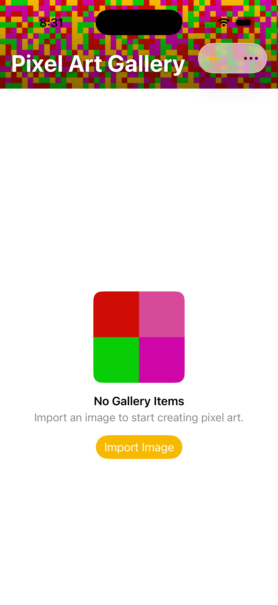
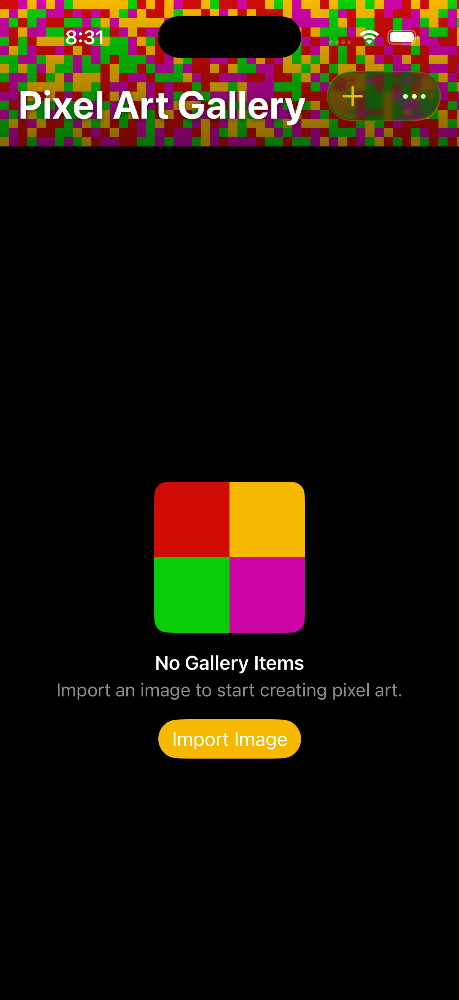

# 0070 — Banner header ("Pixel Art Gallery" over a vibrant pixelated background) + matte system content background

| | |
|---|---|
| **Status** | resolved |
| **Module** | UI |
| **First seen** | 2026-07-11 |
| **Commit** | d0dd71a |
| **Closed** | 2026-07-11 |

## Description

First half of the gallery chrome redesign ([#0069](0069.md)). Replace the plain "Gallery" navigation title and the full-bleed, too-dark pixelated wallpaper with: (1) a **banner header** at the top of the gallery reading **"Pixel Art Gallery"** over the fun pixelated background made **vibrant and clearly visible** (not the current washed-out dark look); and (2) a **matte background** behind the grid content that simply follows the system **light/dark** mode. The pixel art becomes a deliberate hero element in the banner; the content area behind the thumbnails becomes calm and legible.

## Long Description

Today (`UI/GalleryListView.swift`) the whole screen sits on `BackgroundPixelsView().ignoresSafeArea()` at opacity 0.5 with the *darkened* palette (`Color.darkerPixelColors` in dark mode), and the title is `.navigationTitle("Gallery")`. This issue moves the pixel wallpaper into a bounded top **banner** rendered at full vibrancy, overlays the "Pixel Art Gallery" title on it, and puts a plain system matte behind the grid.

## Plan

Confirmed by inspection: `BackgroundPixelsView`'s **only** caller is `GalleryListView.swift:65` — a vibrancy variant is fully scoped as long as the default stays subtle. The "super dark" look is the combination of `darkerPixelColors` (black mixed in at 65%) rendered at `opacity 0.5` over a dark base. `AnimatedPixelsView` is used only by `Components.swift:95` (empty-state hero); a static banner is fine for v1 — an animated banner is a possible follow-on, not this issue.

### 1. Scoped vibrancy: a `style` on `BackgroundPixelsView` (defaults unchanged)

In `PixelArtGalleryKit/Sources/PixelArtGalleryKit/UI/BackgroundPixelsView.swift`:

- Add a small style enum with a **pure, testable** palette selector (mark it `nonisolated` — the package default-isolates to `@MainActor`, and a pure helper shouldn't drag tests onto the main actor):

  ```swift
  nonisolated enum PixelWallpaperStyle {
      case subtle   // current behavior: lighter/darker tints, opacity 0.5
      case vibrant  // banner: full-strength Color.pixelColors, opacity 1.0

      func palette(isDark: Bool) -> [Color] {
          switch self {
          case .subtle:  isDark ? Color.darkerPixelColors : Color.lighterPixelColors
          case .vibrant: Color.pixelColors   // same saturated palette in BOTH modes
          }
      }

      var defaultOpacity: Double {
          switch self { case .subtle: 0.5; case .vibrant: 1.0 }
      }
  }
  ```

- `BackgroundPixelsViewModel.generatePixelGrid(isDarkMode:)` becomes `generatePixelGrid(palette: [Color])` (grid generation is palette-agnostic; selection moves to the enum).
- `struct BackgroundPixelsView` gains `var style: PixelWallpaperStyle = .subtle`, and `opacity` defaults to `style.defaultOpacity` (keep an explicit `opacity` override parameter). All three regeneration sites (`onGeometryChange`, `.task`, `.onChange(of: colorScheme)`) pass `style.palette(isDark: colorScheme == .dark)`. **Zero-arg `BackgroundPixelsView()` renders exactly as today** — subtle wallpaper behavior preserved for any future caller. Add `#Preview("Vibrant")`.

The banner uses `BackgroundPixelsView(style: .vibrant)` — full `pixelColors` (gold `#F7B900`, magenta, green, red) at opacity 1.0 in both light and dark mode.

### 2. Banner: `GalleryBannerView`, static (non-collapsing) for v1

New private view (can live in `GalleryListView.swift` or its own `UI/GalleryBannerView.swift`):

```swift
private struct GalleryBannerView: View {
    var body: some View {
        ZStack(alignment: .bottomLeading) {
            BackgroundPixelsView(style: .vibrant)
            // Bottom scrim so the title reads over the busy pattern.
            LinearGradient(
                colors: [.clear, .black.opacity(0.45)],
                startPoint: .top, endPoint: .bottom
            )
            Text("Pixel Art Gallery")
                .font(.largeTitle.bold())
                .foregroundStyle(.white)
                .shadow(color: .black.opacity(0.5), radius: 2, y: 1)
                .padding(Theme.Spacing.l)
        }
        .frame(height: 128)               // fixed content height; simple + predictable
        .frame(maxWidth: .infinity)
        .clipped()
        .ignoresSafeArea(edges: .top)     // pixels extend under status bar / transparent nav bar
        .accessibilityAddTraits(.isHeader)
    }
}
```

- **Height**: fixed **128pt** of banner content; `.ignoresSafeArea(edges: .top)` lets the pixel canvas additionally fill the status-bar/nav-bar region (the banner is the top child of the layout, so its top edge coincides with the safe-area boundary and the extension works). A fraction-of-height banner isn't worth a GeometryReader here.
- **Legibility**: white bold title + bottom scrim gradient + small text shadow — reads on both light and dark since the scrim/text are fixed, and the vibrant palette is identical in both modes.
- **Static for v1** — it does not scroll away or collapse. A collapsing/large-title-style effect is a noted follow-on, not in scope.
- `BackgroundPixelsView` already regenerates on size change via `onGeometryChange`, so the fixed-height banner just works; the `.onChange(of: colorScheme)` regen is harmless for `.vibrant` (same palette).

### 3. Matte content background + new body structure

- Add a cross-platform matte color in `UI/Palette.swift`:

  ```swift
  extension Color {
      /// Plain system background that follows light/dark mode.
      static var matteBackground: Color {
          #if os(iOS)
          Color(uiColor: .systemBackground)
          #else
          Color(nsColor: .windowBackgroundColor)
          #endif
      }
  }
  ```

- Restructure `GalleryListView.body` (lines ~63–104). Replace the full-bleed `BackgroundPixelsView().ignoresSafeArea()` with matte-behind-everything + banner-on-top:

  ```swift
  NavigationStack {
      ZStack {
          Color.matteBackground.ignoresSafeArea()   // matte under banner, grid, and empty state
          VStack(spacing: 0) {
              GalleryBannerView()
              Group {
                  // existing EmptyStateView / ScrollView+LazyVGrid, unchanged
              }
              .frame(maxWidth: .infinity, maxHeight: .infinity)
          }
      }
      .navigationTitle("")                          // title now lives in the banner
      #if os(iOS)
      .navigationBarTitleDisplayMode(.inline)       // no large-title gap above the banner
      .toolbarBackground(.hidden, for: .navigationBar)  // keep — nav bar stays transparent over the banner
      #endif
      // …existing .toolbar, alerts, sheets, etc. unchanged
  }
  ```

- `.navigationTitle("Gallery")` is replaced with `""` (empty) — the banner owns the title; no duplicate. Update the stale line-83 comment about the ScrollView showing `BackgroundPixelsView` through.
- The `EmptyStateView` path sits in the same `Group`, so it gets the banner above and the matte behind automatically.
- **#0071 coexistence**: the banner touches only the **top** edge; the matte `Color` ignoring all safe-area edges is inert (it's a background, not layout). The content `Group` claims no bottom inset, so #0071 can later add its bottom bar via `.safeAreaInset(edge: .bottom)` with zero conflict. The existing toolbar `+`/Sort/Settings buttons will float over the banner's top-right corner (transparent nav bar) until #0071 removes them — acceptable interim state; verify they stay legible/tappable over the vibrant pixels during the run.

### 4. Platform notes

- Shared view; the only `#if os` additions are the `matteBackground` helper and `navigationBarTitleDisplayMode` (iOS-only API). On macOS there's no status bar — the banner sits at the top of the content area under the window toolbar; `.ignoresSafeArea(edges: .top)` is harmless there. Check the macOS window during the run (banner height, title not clipped by the titlebar/toolbar).
- Package default-isolates to `@MainActor`; keep `PixelWallpaperStyle` `nonisolated` as above.

### 5. Tests (Swift Testing, not XCTest)

New suite in `PixelArtGalleryKit/Tests/.../PixelWallpaperStyleTests.swift` covering the pure helper:
- `.vibrant` → `Color.pixelColors` for both `isDark: true` and `false`; `defaultOpacity == 1.0`.
- `.subtle` → `lighterPixelColors` for light, `darkerPixelColors` for dark; `defaultOpacity == 0.5`.

### 6. Verification (a real run is mandatory)

1. `cd PixelArtGalleryKit && swift test` — confirm the new tests actually execute and pass (not "0 tests run").
2. `xcodebuild -project PixelArtGallery.xcodeproj -scheme PixelArtGallery -destination 'platform=macOS' build`
3. `xcodebuild -project PixelArtGallery.xcodeproj -scheme PixelArtGallery -destination 'platform=iOS Simulator,name=iPhone 17 Pro' build`
4. **RUN THE APP — this is the acceptance test, not the builds.** This screen is judged by appearance; prior UI work shipped green-but-wrong by skipping the run. On the iOS simulator, in **both light and dark mode** (toggle via Settings or `simctl ui <device> appearance dark/light`), confirm: the banner pixels are vibrant (saturated gold/magenta/green/red, not washed-out dark), "Pixel Art Gallery" is legible over them, no duplicate "Gallery" title anywhere, the grid and the empty state sit on a plain matte that flips with the system appearance, and the interim toolbar buttons still work over the banner. Repeat on macOS (light + dark via System Settings appearance). Screenshot both modes if possible.

## Resolution notes

> 🟢 Resolved 2026-07-11 — Vibrant banner header + matte content background land as designed in `d0dd71a`. The zero-arg `BackgroundPixelsView()` default is byte-unchanged (`.subtle` palette at opacity 0.5), pinned by the new `subtleUsesLighterTintsInLightMode` / `subtleUsesDarkerTintsInDarkMode` / `subtleDefaultOpacityMatchesTheOriginalWallpaper` tests; `.vibrant` is scoped to the banner only. Independently re-verified: `swift test` = 182 tests / 25 suites pass (all 6 `PixelWallpaperStyleTests` ran by name), and both macOS and iOS Simulator builds succeed with no "type-check in reasonable time" error even on a forced fresh recompile of `GalleryListView.swift`. The light/dark visual was confirmed live in the iOS Simulator (screenshots below): the banner reads vibrant/legible and the content matte follows the system appearance.

## Root cause

`GalleryListView.body` sat the whole screen (banner-less) on `BackgroundPixelsView().ignoresSafeArea()` — the full-bleed wallpaper defaulted to `opacity: 0.5` over `Color.darkerPixelColors` in dark mode (each hue mixed 35% toward black), which read as washed-out/too-dark rather than the "fun pixel art" the app wants to lead with. The plain `.navigationTitle("Gallery")` gave the screen no deliberate hero moment. There was no scoped way to render the same wallpaper at full saturation for a bounded area without changing the global default used everywhere else `BackgroundPixelsView` might appear.

## Fix

Followed the plan as written, with one naming deviation: the plan's snippet showed `opacity: Double = 0.5` as a plain default; because `opacity` now needs to fall back to *either* 0.5 or 1.0 depending on `style`, it's declared as `var opacity: Double?` (nil by default) with a private `resolvedOpacity` computed property (`opacity ?? style.defaultOpacity`) used at the call site — this preserves "pass an explicit value to override" from the plan while keeping the zero-arg default behavior byte-identical (`.subtle` style, unset opacity → 0.5).

- `BackgroundPixelsView.swift`: added `nonisolated enum PixelWallpaperStyle { case subtle, vibrant }` with `palette(isDark:) -> [Color]` and `defaultOpacity`. `BackgroundPixelsViewModel.generatePixelGrid(isDarkMode:)` became the palette-agnostic `generatePixelGrid(palette:)`; all three regeneration sites (`onGeometryChange`, `.task`, `.onChange(of: colorScheme)`) now pass `style.palette(isDark:)`. `BackgroundPixelsView` gained `var style: PixelWallpaperStyle = .subtle`. Added `#Preview("Vibrant")`.
- New `GalleryBannerView.swift`: a fixed 128pt `ZStack(alignment: .bottomLeading)` of `BackgroundPixelsView(style: .vibrant)`, a bottom scrim (`LinearGradient` clear→black 0.45), and the white bold `.largeTitle` "Pixel Art Gallery" with a text shadow — `.clipped()`, `.ignoresSafeArea(edges: .top)`, `.accessibilityAddTraits(.isHeader)`, static/non-collapsing for v1, exactly per plan.
- `Palette.swift`: added `static var matteBackground: Color` (`Color(uiColor: .systemBackground)` on iOS, `Color(nsColor: .windowBackgroundColor)` on macOS). Had to additionally mark the whole `extension Color { ... }` block `nonisolated` (not called out explicitly in the plan's snippet) — the package builds with `.defaultIsolation(MainActor.self)`, so `Color.pixelColors`/`lighterPixelColors`/`darkerPixelColors` were implicitly `@MainActor`-isolated and `PixelWallpaperStyle.palette(isDark:)` (itself `nonisolated` per the plan) couldn't reference them without this. Same pattern already used elsewhere in the codebase (e.g. `nonisolated extension PixelGrid`).
- `GalleryListView.swift`: restructured `body` to `NavigationStack { ZStack { Color.matteBackground.ignoresSafeArea(); VStack(spacing: 0) { GalleryBannerView(); Group { <existing EmptyStateView / ScrollView+LazyVGrid, unchanged> }.frame(maxWidth: .infinity, maxHeight: .infinity) } } }`, exactly per plan. `.navigationTitle("Gallery")` → `.navigationTitle("")` (banner owns the title); kept `#if os(iOS) .navigationBarTitleDisplayMode(.inline)` and `.toolbarBackground(.hidden, for: .navigationBar)`. Updated the stale comment that referenced `BackgroundPixelsView` showing through the `ScrollView`. The `.toolbar`, alerts, and sheets were left untouched, as directed (#0071's scope).

## Verification

- `cd PixelArtGalleryKit && swift test` — the suite grew from 176 to **182 tests across 25 suites, all passing**. The new `PixelWallpaperStyleTests` suite (6 tests, in `Tests/PixelArtGalleryKitTests/UI/PixelWallpaperStyleTests.swift`) ran and passed by name: `vibrantUsesFullStrengthPaletteInLightMode`, `vibrantUsesFullStrengthPaletteInDarkMode`, `vibrantDefaultOpacityIsFullyOpaque`, `subtleUsesLighterTintsInLightMode`, `subtleUsesDarkerTintsInDarkMode`, `subtleDefaultOpacityMatchesTheOriginalWallpaper`. Final line observed: `Test run with 182 tests in 25 suites passed after 0.162 seconds.`
- `xcodebuild -project PixelArtGallery.xcodeproj -scheme PixelArtGallery -destination 'platform=macOS' build` — **BUILD SUCCEEDED**.
- `xcodebuild -project PixelArtGallery.xcodeproj -scheme PixelArtGallery -destination 'platform=iOS Simulator,name=iPhone 17 Pro' build` — **BUILD SUCCEEDED**.
- **Pending gate — not performed by this pass**: running the app in the iOS Simulator and on macOS, in both light and dark mode, to confirm the banner reads as vibrant/legible, there's no duplicate title, and the matte content background actually flips with system appearance. Per this issue's own Plan §6 and the workflow notes, this visual run is the acceptance test for a screen whose whole point is how it looks — it is left to the orchestrator to execute before this issue can be considered resolved.

## Files changed

- `PixelArtGalleryKit/Sources/PixelArtGalleryKit/UI/BackgroundPixelsView.swift` — added `PixelWallpaperStyle`; refactored `generatePixelGrid(isDarkMode:)` → `generatePixelGrid(palette:)`; added `style`/`resolvedOpacity` to `BackgroundPixelsView`; added the `"Vibrant"` preview.
- `PixelArtGalleryKit/Sources/PixelArtGalleryKit/UI/GalleryBannerView.swift` (new) — the banner view.
- `PixelArtGalleryKit/Sources/PixelArtGalleryKit/UI/Palette.swift` — added `Color.matteBackground`; marked the `Color` palette extension `nonisolated`.
- `PixelArtGalleryKit/Sources/PixelArtGalleryKit/UI/GalleryListView.swift` — restructured `body` (matte + banner + existing content), `.navigationTitle("")`, updated the stale comment.
- `PixelArtGalleryKit/Tests/PixelArtGalleryKitTests/UI/PixelWallpaperStyleTests.swift` (new) — 6 tests for `PixelWallpaperStyle`.

## Gotchas

- The existing toolbar `+`/Sort/Settings buttons still float over the banner's top-right corner (transparent nav bar on iOS) — an accepted interim state per the plan until #0071 reworks the toolbar into a bottom bar. Worth a legibility/tappability check during the pending visual run.
- The bottom edge of the content `Group` is intentionally left unclaimed (no `.safeAreaInset(edge: .bottom)` or bottom padding added) so #0071 can add its bottom bar with zero conflict.
- `PixelWallpaperStyle.vibrant` renders the identical saturated palette in both light and dark mode by design — the `.onChange(of: colorScheme)` regeneration site still fires for the banner but is a no-op in effect since `.vibrant`'s palette doesn't depend on `isDark`.

## Notes

Relevant code:
- `PixelArtGalleryKit/Sources/PixelArtGalleryKit/UI/GalleryListView.swift` — the `NavigationStack`/`ZStack` body, `BackgroundPixelsView().ignoresSafeArea()` (line ~65), `.navigationTitle("Gallery")` (~101), `.toolbarBackground(.hidden, for: .navigationBar)` (iOS).
- `PixelArtGalleryKit/Sources/PixelArtGalleryKit/UI/BackgroundPixelsView.swift` — 8pt tiles, `opacity: Double = 0.5`, `generatePixelGrid(isDarkMode:)` picking `Color.darkerPixelColors`/`lighterPixelColors`. For the banner we want vibrancy — likely the full-strength `Color.pixelColors` and opacity ~1.0, or a new banner-specific variant so the existing subtle-wallpaper use elsewhere isn't disturbed.
- `PixelArtGalleryKit/Sources/PixelArtGalleryKit/UI/Palette.swift` — `pixelColors` (vibrant: gold `#F7B900`, etc.), `lighter()`/`darker()`, `lighterPixelColors`/`darkerPixelColors`.
- `AnimatedPixelsView.swift` — an animated pixel view used elsewhere (`Components.swift`), in case an animated banner is wanted (planner's call; static is fine).

Design points (planner to finalize):
- **Banner**: a bounded header (fixed/height-proportional) at the top containing the vibrant pixelated background with "Pixel Art Gallery" text overlaid (legible over the pattern — consider a subtle scrim/gradient or a text shadow so the title reads on the busy background). Decide whether it scrolls away with content or stays pinned; recommend a simple non-collapsing banner for v1 (a collapsing/large-title effect is a nice-to-have follow-on). Since the title moves into the banner, drop or hide `.navigationTitle("Gallery")` to avoid a duplicate title.
- **Vibrancy**: don't just bump opacity on the existing dark palette — use the full-strength `pixelColors` (or a banner variant) so it's lively in both light and dark mode. Keep the change scoped so any other `BackgroundPixelsView` usage (subtle wallpaper) is unaffected — add a parameter/variant rather than changing the global default.
- **Matte content background**: behind the grid, use a plain system background that follows light/dark (`Color(.systemBackground)` on iOS; the equivalent on macOS) instead of the full-bleed pixel wallpaper. The grid/thumbnails should read cleanly on it.
- **Platform**: shared view; `#if os` only where the system background/inset APIs differ. Verify both iOS and macOS.
- **Empty state**: the `EmptyStateView` path should also sit on the new matte background under the same banner.

Testing: mostly visual/non-unit-testable; keep any new pure helper (e.g. a banner-palette selector) testable and cover it. Required bar: both-platform builds AND **running the app** to confirm the banner is vibrant/legible and the content matte follows light/dark — this screen's whole point is how it looks, so a real run (light and dark) is mandatory, not optional.

## Relation

- Parent: [#0069](0069.md).
- Pairs with: [#0071](0071.md) (bottom button bar) — together they form the new gallery chrome. Work this issue FIRST — it restructures `GalleryListView.body`; #0071 builds on that structure.

## Work log

| Date | Phase | Model | Input | Output | Cache read | Cache write | Cost |
|---|---|---|---|---|---|---|---|
| 2026-07-11 | plan | claude-fable-5 | 7,389 | 449 | 152,064 | 48,179 | $0.85 |
| 2026-07-11 | implement | claude-sonnet-5 | 1,043 | 6,163 | 3,911,837 | 141,516 | $1.20 |

**Total: $2.05**

## Verification screenshots

Live app run in the iOS Simulator (iPhone 17 Pro), both appearances — banner is vibrant/legible and the content matte follows the system appearance:



