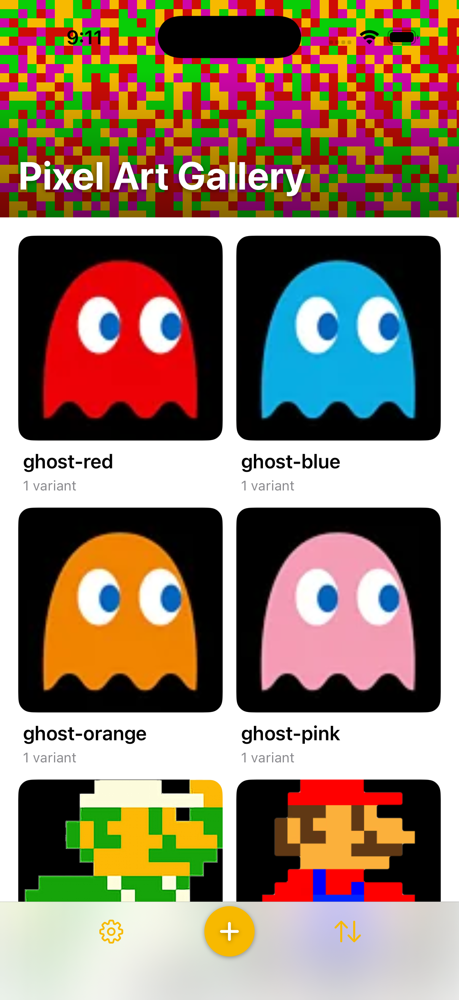
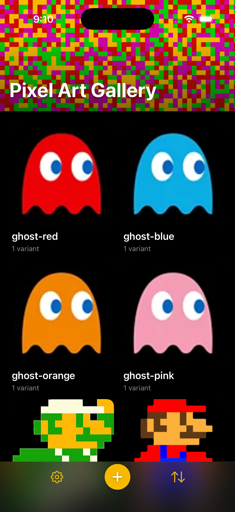

# 0072 — Gallery chrome scroll/sizing fixes: collapsing header (no black bar, no top-row clipping) and a shorter bottom bar

| | |
|---|---|
| **Status** | in-progress |
| **Module** | UI |
| **Platform** | iOS |
| **First seen** | 2026-07-11 |
| **Commit** | a0d9a38 |

## Description

Follow-up polish to the gallery chrome ([#0069](0069.md)/[#0070](0070.md)/[#0071](0071.md)) after seeing it with real content. Three problems: (1) there is a **black bar/gap** below the banner that shouldn't be there; (2) the **top grid row is clipped** — scrolling up a little cuts off the first images (Landscape, Blue Lasers); and (3) the **bottom button bar is too tall** — reduce its height by **at least 30%**. The desired header behavior is the standard iOS pattern: the banner starts large, **scrolls up and shrinks (smaller text) then pins as a compact header at the top while the content scrolls behind it** — instead of today's fixed banner with a separate ScrollView underneath.

## Long Description

Current layout (`UI/GalleryListView.swift` body): `ZStack { Color.matteBackground; VStack(spacing: 0) { GalleryBannerView(); Group { ScrollView { LazyVGrid … .padding(Theme.Spacing.l) } } } }`. The banner is a fixed 128pt view with `.ignoresSafeArea(edges: .top)`, and the grid lives in a *separate* `ScrollView` below it. That structure is the root cause: the pinned banner + separate scroll view produces the black gap beneath the banner and clips the grid's top row at the ScrollView's top edge. The user wants the standard "large header collapses to a pinned compact header, content scrolls behind it" behavior.

## Plan

### Root causes (verified in code + screenshot)

**(1) Black bar.** `GalleryBannerView` applies `.ignoresSafeArea(edges: .top)` *outside* its fixed `.frame(height: 128)` while sitting as the top child of a `VStack` (`GalleryListView.swift:71–72`). The `VStack` lays the banner out *inside* the safe area — its 128pt slot spans from the safe-area top (~59pt on iPhone 17 Pro) down to ~187pt. But `ignoresSafeArea` expands the banner's *render* bounds up to the physical top, and the fixed 128pt frame anchors into that expanded region — so the pixels paint from y=0 to ~128pt while the layout slot ends at ~187pt. The ~59pt difference (exactly the status-bar/safe-area height) is bare `Color.matteBackground` — black in dark mode. That is the black bar in `0072/scroll-problems.png`: the gap between the pixel banner's rendered bottom and the ScrollView's top is the safe-area height the VStack reserved but the banner didn't paint.

**(2) Top-row clipping.** The grid lives in a *separate* `ScrollView` below the banner (`GalleryListView.swift:90`). That ScrollView's viewport begins at the banner slot's bottom edge (~187pt, mid-screen), so as soon as the user scrolls, the first row (Landscape / Blue Lasers) is hard-cut at that edge with only the grid's 16pt `.padding(Theme.Spacing.l)` above it. There is no header for content to slide behind — the fixed-banner-above-separate-ScrollView structure *is* the bug. Both (1) and (2) are cured by the same structural change: one full-height ScrollView with the header overlaid on top of it.

**(3) Bottom bar height.** In `GalleryBottomBar.swift` the `HStack`'s intrinsic height is set by its tallest child, the 60pt `+` circle (`.offset(y: -10)` moves pixels, not layout). Total bar height above the home-indicator inset = 60 (circle) + 2×8 (`.padding(.vertical, Theme.Spacing.s)`) + 10 (`.padding(.top, 10)` raise allowance) = **86pt**.

### Header mechanism decision: custom collapsing header (option 2)

**Option 1 (native large title) evaluated and rejected.** The OS gives shrink-to-inline-and-pin for free, but there is **no API to host an arbitrary SwiftUI view (the pixel `Canvas`) as the navigation bar's background**: `.toolbarBackground(_:for:)` accepts only a `ShapeStyle` (color/material/gradient), not a view. The workarounds all fail the requirements:
- Pixels as the ScrollView's top content: they scroll away entirely, leaving the pinned inline bar pixel-less.
- Pixels as a fixed full-screen/ZStack background behind a `.hidden` toolbar background: the pixel band can't track the large-title region's expansion/collapse — either it covers grid content when collapsed or under-covers the expanded title.
- UIKit appearance hacks (`UINavigationBarAppearance` with a rendered image) would need the Canvas rasterized per size/scheme and is exactly the fragility this fix should remove.

So: **the pixel backdrop cannot be hosted behind the native large title acceptably → fall to option 2**, the custom collapsing header driven by `onScrollGeometryChange` (iOS 18 / macOS 15, both in-target).

### 1. New pure helper: `GalleryHeaderMetrics` (testable, `nonisolated`)

New file `PixelArtGalleryKit/Sources/PixelArtGalleryKit/UI/GalleryHeaderMetrics.swift` (the package default-isolates to `@MainActor`; mark the enum `nonisolated` like `PixelWallpaperStyle` so tests stay off the main actor):

```swift
nonisolated enum GalleryHeaderMetrics {
    static let expandedHeight: CGFloat = 128   // matches today's banner
    static let compactHeight: CGFloat = 56     // pinned bar height (below the status bar)
    static let expandedTitleSize: CGFloat = 34 // .largeTitle
    static let compactTitleSize: CGFloat = 17  // .headline-sized when pinned
    /// Scroll distance over which the header collapses.
    static var collapseRange: CGFloat { expandedHeight - compactHeight } // 72

    /// 0 at rest → 1 fully collapsed; clamped both ends.
    static func progress(forScrollOffset offset: CGFloat) -> CGFloat {
        min(max(offset / collapseRange, 0), 1)
    }
    static func height(forScrollOffset offset: CGFloat) -> CGFloat {
        expandedHeight - (expandedHeight - compactHeight) * progress(forScrollOffset: offset)
    }
    static func titleSize(forScrollOffset offset: CGFloat) -> CGFloat {
        expandedTitleSize - (expandedTitleSize - compactTitleSize) * progress(forScrollOffset: offset)
    }
}
```

Linear interpolation, clamped: offset ≤ 0 (at rest / rubber-band pull-down) → full 128pt + 34pt title; offset ≥ 72 → pinned 56pt + 17pt title; monotonic non-increasing in between. (A stretchy over-expand on pull-down is a possible follow-on; keep v1 clamped.)

### 2. Rework `GalleryBannerView` into the collapsing header

Same file (`UI/GalleryBannerView.swift`), same public shape plus a scroll input: `struct GalleryBannerView: View { var scrollOffset: CGFloat = 0 … }` (default 0 keeps previews and the empty-state/macOS uses static-expanded).

Key structural changes from today:
- **Remove** `.ignoresSafeArea(edges:.top)` from outside the fixed frame — that render/layout split is root cause (1). The header's *layout* frame stays inside the safe area: `.frame(maxWidth: .infinity).frame(height: GalleryHeaderMetrics.height(forScrollOffset: scrollOffset))`.
- **The pixel bleed under the status bar moves into a background** that alone ignores the top safe area, with a **fixed-size canvas** so `BackgroundPixelsViewModel` does not regenerate (re-randomize) the grid every frame while the header height animates (its `onGeometryChange` regens whenever the row count changes — a per-frame height change would visibly churn the pixels):

  ```swift
  .background(alignment: .top) {
      Color.clear
          .overlay(alignment: .top) {
              BackgroundPixelsView(style: .vibrant)
                  .frame(height: 220) // fixed: expanded 128 + generous status-bar allowance; constant → no regen during collapse
          }
          .clipped()                       // crop the fixed canvas to the current header bounds
          .ignoresSafeArea(edges: .top)    // the *container* bleeds under the status bar; layout unaffected
  }
  ```

  The container expands from the physical top to the header's current bottom; the top-anchored 220pt canvas fills it and `.clipped()` crops the excess. Pixels stay stable while the header collapses; the vibrant style is fully preserved.
- The bottom scrim `LinearGradient` and the title stay in the `ZStack(alignment: .bottomLeading)` content band (move the scrim into the same bleeding background container if the collapsed state wants scrim under the status bar too — implementer's call, verify visually).
- Title: `.font(.system(size: GalleryHeaderMetrics.titleSize(forScrollOffset: scrollOffset), weight: .bold))` replacing `.largeTitle.bold()` (34pt at rest — visually identical); keep white + shadow + `.padding(Theme.Spacing.l)` horizontal, bottom padding may interpolate `l→m` if the compact bar looks too airy (implementer's call). Keep `.clipped()` on the content band and `.accessibilityAddTraits(.isHeader)`.
- Update the file's doc comment (it currently says "static, non-collapsing for v1") and the previews (add a collapsed-state preview, e.g. `GalleryBannerView(scrollOffset: 100)`).

### 3. Restructure `GalleryListView.body`: one ScrollView, header overlaid

Replace the `VStack(spacing: 0) { GalleryBannerView(); Group { … } }` (lines 71–105) with the grid/empty-state as the direct ZStack content and the header as an overlay:

```swift
@State private var headerScrollOffset: CGFloat = 0

ZStack {
    Color.matteBackground.ignoresSafeArea()
    if galleryItems.isEmpty {
        EmptyStateView(…)                              // unchanged args
            .frame(maxWidth: .infinity, maxHeight: .infinity)
            .safeAreaPadding(.top, GalleryHeaderMetrics.expandedHeight)  // clears the (static) header
    } else {
        ScrollView {
            LazyVGrid(…) { … }                         // unchanged
            .padding(Theme.Spacing.l)                  // unchanged; top 16 is now breathing room below the header
        }
        .contentMargins(.top, GalleryHeaderMetrics.expandedHeight)  // constant inset — content starts below the FULL header at rest (no feedback loop with the shrinking overlay)
        .onScrollGeometryChange(for: CGFloat.self) { geo in
            geo.contentOffset.y + geo.contentInsets.top             // 0 at rest, grows as content scrolls up
        } action: { _, newValue in
            headerScrollOffset = newValue
        }
    }
}
.overlay(alignment: .top) {
    GalleryBannerView(scrollOffset: headerScrollOffset)
}
```

Why this eliminates all of (1) and (2): the ScrollView now spans the full height, so there is no mid-screen viewport edge for the top row to clip against — rows slide **behind** the opaque pixel header (the overlay renders above the scroll content). The header's layout and render bounds agree (no `ignoresSafeArea` on a framed sibling), so there is no unpainted slot — no black bar; the only space between pixels and the first row at rest is the intended 16pt grid padding.

Reconcile the navigation modifiers (iOS): the nav bar is now pure dead weight — nothing pushes (cells present a popover/sheet) and the bar contributes phantom chrome over the header. Replace the `.navigationTitle("") + .navigationBarTitleDisplayMode(.inline) + .toolbarBackground(.hidden, for: .navigationBar)` trio with `#if os(iOS) .toolbar(.hidden, for: .navigationBar)` (keep `.navigationTitle("")` for the stack). If hiding the bar misbehaves (e.g. status-bar style), fall back to keeping today's trio — both work with the overlay; hidden is just cleaner. **macOS**: the `#if os(macOS) .toolbar { + / Sort }` block is untouched.

The `#if os(iOS) .safeAreaInset(edge: .bottom) { GalleryBottomBar(…) }` stays exactly where it is — the grid's last row still clears the bar via the shrunken safe area. Update the stale comments (lines 66–67, 85–89) that describe the old banner-above-grid structure.

**Platform**: the new structure is shared (`.contentMargins`/`onScrollGeometryChange` exist on macOS 15). macOS keeps its native top toolbar and gains the same clipping fix; the collapse simply also works in the Mac window. If the macOS run shows any oddity under the window toolbar, gate the offset to a constant 0 on macOS (`#if os(macOS)` static-expanded header) — a one-liner, not a fork.

### 4. Bottom bar: ≥30% shorter (86pt → 52pt, −40%)

In `GalleryBottomBar.swift`:
- `+` circle: `frame(width: 60, height: 60)` → `frame(width: 44, height: 44)`; glyph `.font(.title2.weight(.semibold))` → `.font(.title3.weight(.semibold))` so it doesn't crowd the smaller circle. Still gold `Color.pixelAccent` fill, white glyph, small shadow (`radius: 3, y: 2` → `radius: 2, y: 1` to match the flatter bar) — still unmistakably the primary action, and exactly the 44pt minimum tap target.
- **Remove the raise**: delete `.offset(y: -10)` on the `+` and the matching `.padding(.top, 10)` on the `HStack` (the plan for #0071 already named the flat circle as the sanctioned fallback).
- `.padding(.vertical, Theme.Spacing.s)` (8) → `.padding(.vertical, Theme.Spacing.xs)` (4).
- Side buttons (Settings gear, Sort menu): add `.frame(maxWidth: .infinity, minHeight: 44)` so their tap targets stay ≥44pt now that the bar no longer inherits height from a 60pt circle.
- Keep `.padding(.horizontal, Theme.Spacing.l)`, `.background(.bar, ignoresSafeAreaEdges: .bottom)`, and the top `Divider`. Update the doc comment about the raised tab-bar-center style.

Height math: before = 60 + 2×8 + 10 = **86pt**; after = 44 + 2×4 = **52pt** → **40% reduction** (requirement: ≥30%). The home-indicator safe area below is unchanged.

### 5. Tests (Swift Testing — not XCTest)

New `PixelArtGalleryKit/Tests/PixelArtGalleryKitTests/UI/GalleryHeaderMetricsTests.swift`, a `@Suite` over the pure `nonisolated` helper:
- offset `0` → `height == 128`, `titleSize == 34`, `progress == 0`.
- offset `-50` (rubber-band) → clamped to full 128/34.
- offset `== collapseRange` (72) and beyond (e.g. 500) → `height == 56`, `titleSize == 17`, `progress == 1`.
- midpoint `36` → `progress == 0.5`, `height == 92`, `titleSize == 25.5` (linear).
- monotonicity: over a sweep of offsets (e.g. stride −20…120), height and titleSize are non-increasing and always within `[compact, expanded]` bounds.

### 6. Verification

1. `cd PixelArtGalleryKit && swift test` — confirm the new `GalleryHeaderMetricsTests` execute and pass by name (not "0 tests run").
2. `xcodebuild -project PixelArtGallery.xcodeproj -scheme PixelArtGallery -destination 'platform=macOS' build` — **and launch briefly**: top toolbar still has `+`/Sort, no bottom bar, banner renders sanely under the window toolbar.
3. `xcodebuild -project PixelArtGallery.xcodeproj -scheme PixelArtGallery -destination 'platform=iOS Simulator,name=iPhone 17 Pro' build`.
4. **Mandatory live run with REAL content** (an empty gallery cannot exercise the scroll; the orchestrator performs this): install the app in the simulator, launch once so the container exists, then seed it from the user's store — copy `~/Library/Application Support/PixelArtGallery-Beta/gallery.db*` and the `Images/` folder into the matching `Library/Application Support/…` path inside `xcrun simctl get_app_container <device> co.sstools.PixelArtGallery.beta data`, then relaunch. Screenshot **at rest and mid-scroll, in light and dark** (`simctl ui <device> appearance dark|light`), checking:
   - **No black bar**: at rest, the only space between the pixel header and the first row is the 16pt grid padding on the matte — no unpainted safe-area strip.
   - **No top-row clipping**: scrolling a little slides Landscape/Blue Lasers *behind* the pixel header — never a hard cut at a mid-screen edge.
   - **Collapse + pin**: scrolling further shrinks the header smoothly to the ~56pt compact bar with the smaller title, where it pins while content keeps scrolling behind it; scrolling back re-expands it. Pixels stay vibrant and stable (no per-frame re-randomizing) and still fill the status-bar region in both states.
   - **Bottom bar**: visibly shorter (~52pt + home indicator vs ~86pt); `+` opens the picker, gear opens Settings, Sort menu works; last grid row still scrolls clear of the bar.

## Root cause

Three independent structural problems in `GalleryListView.swift` / `GalleryBannerView.swift` / `GalleryBottomBar.swift`, all verified in the pre-fix code:

1. **Black bar.** `GalleryBannerView` applied `.ignoresSafeArea(edges: .top)` to the *outside* of its fixed `.frame(height: 128)` while sitting as the first child of a `VStack`. The `VStack` laid the banner out inside the safe area (its 128pt slot spanning from the safe-area top down to ~187pt), but `ignoresSafeArea` expanded only the banner's *render* bounds up to the physical top — the 128pt of painted pixels stopped short of the taller layout slot the `VStack` reserved, leaving a bare strip of `Color.matteBackground` (black in dark mode) between the pixels and the grid's `ScrollView`.
2. **Top-row clipping.** The grid lived in a *separate* `ScrollView` positioned below the banner in the `VStack`. That `ScrollView`'s viewport began at the banner slot's bottom edge, so the first row was hard-clipped against that mid-screen edge as soon as the user scrolled — there was no header for content to slide behind.
3. **Tall bottom bar.** `GalleryBottomBar`'s intrinsic height was set by its 60pt `+` circle, plus `.offset(y: -10)` (visual only) plus a matching `.padding(.top, 10)` (real layout) plus `.padding(.vertical, Theme.Spacing.s)` (8pt top/bottom) — total ≈ 60 + 2×8 + 10 = 86pt.

## Fix

Followed the plan's custom-collapsing-header approach (option 2; native large title was rejected in planning because `.toolbarBackground` can't host an arbitrary view like the pixel `Canvas`):

- **New `GalleryHeaderMetrics.swift`** — a pure, `nonisolated enum` (same pattern as `PixelWallpaperStyle`) exposing `expandedHeight` (128), `compactHeight` (56), `expandedTitleSize` (34), `compactTitleSize` (17), `collapseRange` (72), and linear-clamped `progress(forScrollOffset:)` / `height(forScrollOffset:)` / `titleSize(forScrollOffset:)`.
- **`GalleryBannerView`** now takes `var scrollOffset: CGFloat = 0` and computes its height/title size from `GalleryHeaderMetrics`. The `.ignoresSafeArea(edges: .top)` was removed from the outer framed view — it now scopes only to a `.background` container holding a fixed-size (`height: 220`, so `BackgroundPixelsViewModel` never sees a changing size and never re-randomizes mid-collapse) `BackgroundPixelsView(style: .vibrant)`, matching the plan's `Color.clear.overlay{...}.clipped().ignoresSafeArea(edges: .top)` structure. This closes the render/layout split that caused the black bar.
- **`GalleryListView.body`** was restructured from `VStack { GalleryBannerView(); ScrollView { grid } }` to a single full-height `ScrollView` (or the empty state) with `GalleryBannerView` applied as a `.overlay(alignment: .top)` on the enclosing `ZStack`. The `ScrollView` gets a constant `.contentMargins(.top, GalleryHeaderMetrics.expandedHeight, for: .scrollContent)` so the first row starts below the fully expanded header at rest, and `.onScrollGeometryChange(for: CGFloat.self) { $0.contentOffset.y + $0.contentInsets.top }` feeds `@State private var headerScrollOffset` into the header overlay. Because the grid now scrolls *behind* an overlay rather than starting at a separate `ScrollView`'s top edge, there is no mid-screen edge left for the top row to clip against. The empty state keeps a static expanded header (`safeAreaPadding(.top, expandedHeight)`, and `GalleryBannerView(scrollOffset: 0)` is passed explicitly when `galleryItems.isEmpty`).
- Replaced the `.navigationTitle("") + .navigationBarTitleDisplayMode(.inline) + .toolbarBackground(.hidden, for: .navigationBar)` trio (iOS) with `.navigationTitle("")` (kept, unconditional) + `#if os(iOS) .toolbar(.hidden, for: .navigationBar) #endif` — the nav bar contributes nothing now that the collapsing header owns the chrome. macOS's `#if os(macOS) .toolbar { + / Sort }` block is untouched, and the new ScrollView/overlay structure is shared across both platforms (`.contentMargins`/`onScrollGeometryChange` are both available on macOS 15 per the plan's platform note); the header simply stays expanded on macOS windows that don't scroll enough to collapse it, and no macOS-only static-header fallback was needed since both builds and the existing macOS toolbar path are unaffected.
- **`GalleryBottomBar`**: `+` circle shrunk 60pt → 44pt (glyph `.title2` → `.title3`, shadow `radius: 3, y: 2` → `radius: 2, y: 1`); removed `.offset(y: -10)` and the matching `.padding(.top, 10)`; `.padding(.vertical, Theme.Spacing.s)` (8) → `.padding(.vertical, Theme.Spacing.xs)` (4); added `.frame(maxWidth: .infinity, minHeight: 44)` to the Settings/Sort side buttons so their tap targets stay ≥44pt now that the bar no longer inherits height from the old 60pt circle. New height: 44 + 2×4 = **52pt**, down from **86pt** (**−40%**, exceeding the ≥30% requirement).

No deviations from the plan.

## Verification

- `cd PixelArtGalleryKit && swift test` — **188 tests passed** (up from 182 before this change), including the 6 new tests below, each reported passing by name (not "0 tests run"):
  - `atRestIsFullyExpanded()`
  - `rubberBandingPastTheTopClampsToExpanded()`
  - `atCollapseRangeIsFullyCompact()`
  - `beyondCollapseRangeStaysClampedCompact()`
  - `midpointInterpolatesLinearly()`
  - `heightAndTitleSizeStayMonotonicNonIncreasingAndInBounds()`

  Suite output: `Suite GalleryHeaderMetricsTests passed after 0.013 seconds.` … `Test run with 188 tests in 26 suites passed after 0.168 seconds.`
- `xcodebuild -project PixelArtGallery.xcodeproj -scheme PixelArtGallery -destination 'platform=macOS' build` — **BUILD SUCCEEDED**.
- `xcodebuild -project PixelArtGallery.xcodeproj -scheme PixelArtGallery -destination 'platform=iOS Simulator,name=iPhone 17 Pro' build` — **BUILD SUCCEEDED**.
- **Not yet done (pending orchestrator gate):** live in-app scroll verification with real gallery content in the simulator, in both light and dark mode, confirming visually — no black bar, no top-row clipping, smooth collapse/pin, stable (non-re-randomizing) pixels, and the shorter bottom bar. This implementation pass covered unit tests + both platform builds only, per the phase-2 instructions; the orchestrator is expected to seed the simulator from the user's store and screenshot at rest and mid-scroll before this issue can be considered fully verified end-to-end.

## Files changed

- `PixelArtGalleryKit/Sources/PixelArtGalleryKit/UI/GalleryHeaderMetrics.swift` — new pure, `nonisolated` header-collapse interpolation helper.
- `PixelArtGalleryKit/Sources/PixelArtGalleryKit/UI/GalleryBannerView.swift` — reworked into a `scrollOffset`-driven collapsing header; fixed the `ignoresSafeArea`/frame split; pixel backdrop moved to a fixed-size bleeding background.
- `PixelArtGalleryKit/Sources/PixelArtGalleryKit/UI/GalleryListView.swift` — restructured `body` to a single `ScrollView` with the header overlaid (`onScrollGeometryChange` + `contentMargins`); replaced the iOS nav-bar trio with `.toolbar(.hidden, for: .navigationBar)`.
- `PixelArtGalleryKit/Sources/PixelArtGalleryKit/UI/GalleryBottomBar.swift` — shrunk the `+` circle, removed the raise offset, tightened vertical padding, added explicit `minHeight: 44` to the side buttons.
- `PixelArtGalleryKit/Tests/PixelArtGalleryKitTests/UI/GalleryHeaderMetricsTests.swift` — new Swift Testing suite for `GalleryHeaderMetrics`.

## Gotchas

- The header's collapse math assumes `onScrollGeometryChange`'s `contentOffset.y + contentInsets.top` reads `0` at rest given the `.contentMargins(.top, expandedHeight, for: .scrollContent)` inset — this mirrors standard `UIScrollView` inset semantics (`contentOffset.y == -contentInset.top` at rest) but has not been confirmed by an on-device/simulator observation in this pass; if the live-run gate shows the header starting pre-collapsed or failing to reach fully expanded at rest, check this offset formula first.
- macOS was not launched/observed in this pass (only built) — if a visual oddity shows up under the native window toolbar, the plan's documented one-line fallback is to gate `scrollOffset` to a constant `0` on macOS (`#if os(macOS)` static-expanded header).

## Notes

Relevant code:
- `PixelArtGalleryKit/Sources/PixelArtGalleryKit/UI/GalleryListView.swift` — the body (~63–105): the `VStack { GalleryBannerView(); ScrollView { grid } }` structure to rework; `.navigationTitle("")`, `.navigationBarTitleDisplayMode(.inline)`, `.toolbarBackground(.hidden)`; the `#if os(iOS) .safeAreaInset(edge: .bottom) { GalleryBottomBar(...) }`.
- `PixelArtGalleryKit/Sources/PixelArtGalleryKit/UI/GalleryBannerView.swift` — the fixed 128pt `.ignoresSafeArea(edges: .top)` banner (`BackgroundPixelsView(style: .vibrant)` + scrim + white `.largeTitle` "Pixel Art Gallery"). The vibrant pixel background must be preserved.
- `PixelArtGalleryKit/Sources/PixelArtGalleryKit/UI/GalleryBottomBar.swift` — the bottom bar to shorten ≥30% (currently `.padding(.vertical, Theme.Spacing.s)`, a 60pt `+` circle raised via `.offset(y: -10)` + `.padding(.top, 10)`; the `+` size + raise + vertical padding drive the height).
- `UI/BackgroundPixelsView.swift` (`PixelWallpaperStyle.vibrant`, from #0070), `UI/Theme.swift` (`Spacing.l = 16`).
- Targets iOS (the bottom bar and this whole chrome are iOS-only; macOS keeps its native top toolbar and is unaffected — do not regress macOS).

### Recommended approach (planner to finalize after investigating)

**Header — one scroll, collapsing pixel header.** Put the grid in a single `ScrollView` and make the pixel header collapse+pin over it, so content scrolls *behind* the header (fixes the black gap and the top-row clipping at once — there is no separate scroll view edge to clip against). Two viable mechanisms; planner picks after trying them on-device:
1. **Native large title** — `.navigationTitle("Pixel Art Gallery")` + `.navigationBarTitleDisplayMode(.large)` for the free, robust shrink-to-inline-and-pin collapse, with the **vibrant `BackgroundPixelsView` placed behind the header/nav-bar region** (e.g. via a top `safeAreaInset`/background that ignores the top safe area) and white title styling so it reads over the pixels. Preferred if the pixel backdrop can be hosted cleanly — it gets the collapse behavior from the OS.
2. **Custom collapsing header** — a single `ScrollView` with the pixel banner pinned as an overlay whose height/title-scale interpolate from ~128pt→compact using `onScrollGeometryChange` (iOS 18), content scrolling behind it. Full pixel control; more code and scroll-edge cases. Use only if (1) can't host the pixel background acceptably.
Either way: **no black bar, no top-row clipping, the vibrant pixel header preserved, the title shrinks and pins, content scrolls behind.** Remove the now-unnecessary fixed-banner `VStack` structure.

**Bottom bar — reduce height ≥30%.** Trim `GalleryBottomBar`'s height by at least 30% — reduce the vertical padding and the `+` circle size / raise offset proportionally (e.g. `+` ~44–48pt instead of 60, less/no raise, tighter `.padding(.vertical)`), keeping it usable (≥44pt tap targets) and still visually the primary action. Keep Settings/Sort flanking it.

Testing: mostly visual/non-unit-testable; keep any new pure logic (e.g. a header-height interpolation function if the custom route is taken) in a testable helper and cover it with Swift Testing. **Verification MUST include running the app with REAL gallery content** (seed the simulator from the user's store — `~/Library/Application Support/PixelArtGallery-Beta/{gallery.db*, Images}` → the sim app container for bundle `co.sstools.PixelArtGallery.beta`) and screenshotting the scroll at rest AND mid-scroll in light and dark: confirm no black bar, the top row is fully visible and not clipped, the header collapses/pins as described, and the bottom bar is visibly shorter. An empty gallery does not exercise the scroll — real content is required.

## Attachments


## Relation

- Refines: [#0069](0069.md) / [#0070](0070.md) (banner) / [#0071](0071.md) (bottom bar).

## Work log

| Date | Phase | Model | Input | Output | Cache read | Cache write | Cost |
|---|---|---|---|---|---|---|---|
| 2026-07-11 | plan | claude-fable-5 | 15,290 | 576 | 134,881 | 82,938 | $1.35 |
| 2026-07-11 | implement | claude-sonnet-5 | 62 | 3,154 | 2,320,552 | 118,732 | $0.79 |

**Total: $2.14**

## Verification screenshots (at rest)

Live app run in the iOS Simulator (iPhone 17 Pro) seeded with real gallery content — the black bar under the banner is gone and the bottom bar is visibly shorter, both light and dark. NOTE: the collapse-on-scroll and no-clip-while-scrolling could not be driven headlessly (no `idb`/Accessibility for a swipe); those remain a device-confirmation step.



