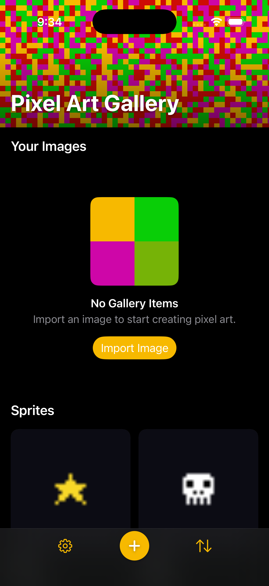

# 0074 — Two-section gallery: user imports (with animated empty state) + an always-present, non-deletable built-in sprites section

| | |
|---|---|
| **Status** | resolved |
| **Module** | UI / ViewModels / Models / Persistence |
| **Platform** | All |
| **First seen** | 2026-07-11 |
| **Commit** | eae0f83 |
| **Closed** | 2026-07-11 |

## Description

Reshape the gallery into **two sections**: (1) **"Your Images"** — the user's imported items, which shows the existing **animated hero empty-state** ("No Gallery Items / Import an image…") when it has 0 items; and (2) **"Sprites"** — the 11 bundled built-in sprites (`sprites/*.png`, 45×35), **always present in the app and non-deletable**. This supersedes the seed-once approach in [#0073](0073.md): rather than seeding deletable copies once, the built-ins are **reconciled on every launch** (any missing ones re-inserted from the bundle) so they can never be permanently removed — deleting everything and relaunching always restores the Sprites section, while the user's imports live in their own section above.

## Long Description

Chosen implementation: the built-in sprites are **real `GalleryItem`s flagged `isBuiltIn = true`**, so the entire tap → send popover ([#0067](0067.md)) → fitted preview → send/save-variant flow keeps working with **zero special-casing** (a built-in is just a `GalleryItem` whose delete affordance is hidden). They are reconciled to always-present on launch (no seed-once flag). The alternative — keeping sprites purely as bundle resources outside SwiftData — was rejected because the send/variant flow is built on `GalleryItem` and would require abstracting the item source everywhere plus a promote-on-save step; flagging real items is far simpler and achieves the same UX (non-deletable, always-present, distinct section). Tiny byte duplication (11 ~250-byte PNGs) is negligible.

Why the user "deleted all images and saw no sprites": [#0073](0073.md) was only filed + planned, never implemented — no code bundles or seeds anything yet. This issue is the implementation, with the corrected always-present design.

## Plan

Verified facts from the code (2026-07-11): `GalleryItem` (`Models/GalleryItem.swift`) already carries the lightweight-migration precedent — `isPinned: Bool = false` (inline default, line 40) and `contentHash: String` defaulted in the init — and its memberwise init is `init(originalImagePath:originalName:originalWidth:originalHeight:contentHash:importedDate:)`. The schema is registered in `PixelArtGallery/PixelArtGalleryApp.swift:14` (`Schema([GalleryItem.self, Variant.self, FlaschenTaschenDisplay.self])`) — adding a defaulted property needs **no schema-list change**. The import path is `GalleryCoordinator.createGalleryItem(name:imageData:)` (`ViewModels/GalleryCoordinator.swift:126`): SHA-256 hash → `contentHash` dup-check (returns `.duplicate` + sets `importMessage`) → `FileStorageManager.save` → ImageIO dims → insert + save. `seedDefaultDisplayIfNeeded()` (line 591) is invoked from `GalleryListView.onAppear` (line 196–202) after `configure(modelContext:)`. `deleteGalleryItem(_:)` (line 852) has exactly one caller: the delete confirmation in `GalleryListView.swift:233`. The #0072 body is a single full-height `ScrollView` holding one adaptive `LazyVGrid` with `.contentMargins(.top, GalleryHeaderMetrics.expandedHeight, for: .scrollContent)` + `.onScrollGeometryChange` feeding the `GalleryBannerView` overlay; `galleryItems.isEmpty` swaps the whole thing for `EmptyStateView(animatedHero: true)` and zeroes the banner offset (line 121). `GallerySendPopoverView` reads only `item.originalName`/the item itself — no delete affordance, no `isBuiltIn`-hostile assumption; `fittedPreview`/`saveVariant` key off `item.id`. `Package.swift` declares no resources yet; `Bundle.module` is unused. All 11 PNGs exist in `sprites/` (coin…star, 45×35).

### 1. Model: `GalleryItem.isBuiltIn`

In `Models/GalleryItem.swift`, mirror the `isPinned` pattern exactly:

```swift
/// Whether this item is one of the bundled built-in sprites (#0074).
/// Built-ins are reconciled to always-present on launch and are
/// non-deletable/non-renamable in the UI. Defaults to `false` so records
/// persisted before this attribute existed load via lightweight migration.
public var isBuiltIn: Bool = false
```

Extend the initializer with a defaulted trailing param `isBuiltIn: Bool = false` (place after `importedDate` so every existing call site — coordinator line 163, tests, previews — compiles unchanged) and assign it. No `PixelArtGalleryApp.swift` change; no `@Query` change needed for migration.

### 2. Bundling (reuse #0073's plan §1 verbatim)

- Copy the 11 PNGs from `sprites/` into new `PixelArtGalleryKit/Sources/PixelArtGalleryKit/Resources/DefaultSprites/` (repo-root `sprites/` stays as generator output).
- `Package.swift`: add `resources: [.copy("Resources/DefaultSprites")]` to the `PixelArtGalleryKit` target (before `swiftSettings`). **`.copy`, not `.process`** — exact bytes, stable `contentHash` across builds/platforms.
- Static ordered manifest on the coordinator:

  ```swift
  static let builtInSpriteNames = [
      "coin", "frog", "ghost", "heart", "invader",
      "mushroom", "pacman", "robot", "ship", "skull", "star",
  ]
  ```

  Display name = `name.capitalized` ("coin" → "Coin"). Lookup: `Bundle.module.url(forResource: name, withExtension: "png", subdirectory: "DefaultSprites")`. `Bundle.module` resolves in the app (Xcode embeds `PixelArtGalleryKit_PixelArtGalleryKit.bundle`) and under `swift test` (SwiftPM stages it next to the runner); a dedicated test asserts all 11 resolve so a bundling regression fails fast.

### 3. `createGalleryItem` learns `isBuiltIn`

Extend the existing method rather than duplicating the pipeline: `createGalleryItem(name:imageData:isBuiltIn: Bool = false)`. Two behavior changes when `isBuiltIn == true`:

- **Skip the `contentHash` duplicate short-circuit.** Presence of a built-in is decided by the reconcile's name+flag match (step 4), not by hash — otherwise a user who happened to import identical bytes (e.g. a repo PNG) would permanently suppress that built-in and pop the "already in your gallery" `importMessage` alert at launch. Guard the dup-check block with `if !isBuiltIn { … }`; the hash is still computed and stored on the item.
- Pass `isBuiltIn: isBuiltIn` into the `GalleryItem(...)` init.

Everything else (save bytes, decode dims, insert, save, logging) is shared, so built-ins get real `FileStorageManager`-persisted originals, real 45×35 dims, and a hash — indistinguishable from imports except for the flag.

### 4. `reconcileBuiltInSpritesIfNeeded()` on `GalleryCoordinator`

New `async` method (the create path awaits the `FileStorageManager` actor), `@discardableResult ... -> Int` (count inserted, for tests). **No `UserDefaults` flag** — presence IS the state; that is exactly what makes built-ins always-restore (deliberately unlike `seedDefaultDisplayIfNeeded`'s empty-registry rule and #0073's seed-once flag).

1. Guard `modelContext != nil` (log via `AppLog.gallery`, return 0) — same as every other mutation.
2. **Re-entrancy guard**: `@ObservationIgnored private var isReconcilingBuiltIns = false`; check-and-set synchronously *before the first `await`*, reset in `defer` — a second `onAppear` (macOS window re-open, iOS nav churn) must not run a concurrent reconcile and double-insert.
3. Fetch the existing built-ins' names **once**: `try modelContext.fetch(FetchDescriptor<GalleryItem>(predicate: #Predicate { $0.isBuiltIn == true }))` → `Set(existing.map(\.originalName))`. (One fetch, not 11; hold the `#Predicate` input in a plain `let` — no computed values inside the macro.)
4. For each manifest name in order, with `displayName = name.capitalized`: if `existingNames.contains(displayName)` → skip. Otherwise load `Bundle.module` bytes and `try await createGalleryItem(name: displayName, imageData: data, isBuiltIn: true)`. **Match key = `isBuiltIn == true && originalName == displayName`** — stable because Rename is disabled for built-ins (step 6); a user item merely *named* "Coin" can't match (flag is false), and can't block the insert.
5. **Per-sprite failure isolation**: missing/unreadable resource → `AppLog.gallery.error`, skip, continue. `createGalleryItem` throw → catch, log, set `currentError = nil` (it assigns `currentError` before rethrowing, and a background reconcile must not pop the launch-time error alert), continue. A reconcile failure never blocks launch and never aborts the remaining sprites.
6. **Never delete anything, never touch user items** — the method only inserts. Idempotent by construction: all 11 present → 0 fetches of bytes, 0 inserts.

Trigger, in `GalleryListView.onAppear` (after `seedDefaultDisplayIfNeeded()`):

```swift
Task { await coordinator.reconcileBuiltInSpritesIfNeeded() }
```

Main-actor `Task` (package default-isolation), actor hops only for file I/O — identical cost to importing 11 ~250-byte PNGs, imperceptible. The `@Query` live-updates the Sprites grid as items insert, which handles the very-first-launch ordering: the two-section body (step 5) renders immediately with the "Your Images" hero and an initially empty Sprites area, and sprite cells stream in within the first frames.

### 5. Two-section gallery body (`UI/GalleryListView.swift`)

**Partition helper (pure, testable).** `nonisolated` static helper — recommend on `GallerySortOrder` (it already owns gallery ordering) or a tiny `GalleryPartition` enum in `Models/`:

```swift
nonisolated static func partition(_ items: [GalleryItem]) -> (user: [GalleryItem], builtIn: [GalleryItem])
```

Order-preserving single pass. The view computes `sortedItems` exactly as today (`sortOrder.sortedForGallery(galleryItems)` — pinning + user sort apply within each section for free), then `let sections = Self.partition(sortedItems)` (or the helper's home).

**Structure.** Keep the #0072 skeleton *untouched* — same single `ScrollView`, same `.contentMargins(.top, GalleryHeaderMetrics.expandedHeight, for: .scrollContent)`, same `.onScrollGeometryChange` — and replace only the ScrollView's content: the bare `LazyVGrid` becomes a `LazyVStack` of two labeled sections, each with its own adaptive grid. Chosen over `Section {} header: {}` inside one `LazyVGrid` because the user section's empty content is the full-width animated hero, not a grid cell — an adaptive grid would size it as one ~150–220pt column. No pinned headers (`pinnedViews: []`, the default) — pinned section headers would collide with the collapsing banner overlay.

```swift
ScrollView {
    LazyVStack(alignment: .leading, spacing: Theme.Spacing.l) {
        sectionHeader("Your Images")
        if sections.user.isEmpty {
            EmptyStateView(
                icon: "photo.on.rectangle.angled",
                title: "No Gallery Items",
                message: "Import an image to start creating pixel art.",
                actionLabel: "Import Image",
                action: { coordinator.showImagePicker = true },
                animatedHero: true
            )
            .frame(maxWidth: .infinity)
            .padding(.vertical, Theme.Spacing.xl)
        } else {
            spriteGrid(for: sections.user)   // the existing LazyVGrid, factored
        }
        if !sections.builtIn.isEmpty {       // hidden for the first frames pre-reconcile / on total bundle failure
            sectionHeader("Sprites")
            spriteGrid(for: sections.builtIn)
        }
    }
    .padding(Theme.Spacing.l)
}
```

`spriteGrid(for:)` is today's `LazyVGrid(columns: [GridItem(.adaptive(minimum: 150, maximum: 220), spacing: Theme.Spacing.m)], alignment: .leading, spacing: Theme.Spacing.m) { ForEach(items) { galleryCellButton(for: $0) } }` factored into a `@ViewBuilder` func — adaptive columns preserved per section. `sectionHeader(_:)` = `Text(title).font(.title3.bold()).foregroundStyle(.primary)` (+ `.accessibilityAddTraits(.isHeader)`) — primary text on the plain `Color.matteBackground` matte is legible in both schemes; no material chip needed since the sections scroll on the matte, not the pixel banner.

**Retire the whole-screen empty state.** Delete the `if galleryItems.isEmpty` branch (lines 76–89): the ScrollView now renders in all states, with the hero scoped to the user section. Simplify the banner overlay back to `GalleryBannerView(scrollOffset: headerScrollOffset)` (the `galleryItems.isEmpty ? 0 : …` special case at line 121 goes away — there is always a ScrollView driving the offset). The hero keeps its Import button, so the empty user section still has the primary CTA above the bottom bar's `+`.

### 6. Non-deletable (and non-renamable) built-ins

- In `galleryCellButton(for:)` (line 316), wrap the context-menu items: **Pin stays for all items** (harmless — a pinned built-in just leads the Sprites section, since partition happens after `sortedForGallery`); **Rename and Delete are user-items-only** (`if !item.isBuiltIn { … }`). Rename must be omitted because `originalName` is the reconcile match key — renaming "Coin" would cause a duplicate re-insert next launch. Cells stay tappable → `GallerySendPopoverView` unchanged.
- **Defense-in-depth in the coordinator**: `deleteGalleryItem(_:)` gains a guard before the delete — `guard !item.isBuiltIn else { AppLog.gallery.error("Refused to delete built-in gallery item \(item.id)"); return }` — so no present or future call site (the confirmation dialog is today's only one) can ever remove a built-in. Similarly guard `renameGalleryItem(_:to:)` (`guard !item.isBuiltIn else { return }`) to protect the match key.
- The delete confirmation (`itemToDelete`) is only ever set from the now-conditional menu item, so it can't target a built-in; the coordinator guard is the backstop.
- **Send/variant path confirmed unchanged**: the popover, `fittedPreview(for:display:)`, and `saveVariant(from:)` operate on `GalleryItem`/`item.id` with no `isBuiltIn` awareness; a saved variant attaches to the built-in item and remains individually deletable via the existing variant UI (`deleteVariant` is untouched — only the *item* is protected).

### 7. Tests (Swift Testing — not XCTest; new suite `BuiltInSpritesTests` beside `GalleryCoordinatorTests`)

Reuse the established patterns: in-memory `ModelContainer` via `makeContext()`, per-test temp `FileStorageManager`, `makeCoordinatorWithIsolatedDefaults()` (`GalleryCoordinatorTests.swift:482`), `makePNGData` for synthetic user imports.

1. **Resources resolve**: every name in `builtInSpriteNames` yields a `Bundle.module` URL with non-empty data (guards the `Package.swift` declaration).
2. **Empty store**: `reconcileBuiltInSpritesIfNeeded()` returns 11; store holds exactly 11 items, all `isBuiltIn == true`, `originalWidth == 45`, `originalHeight == 35`, names == the 11 capitalized manifest names, non-empty `contentHash`.
3. **Idempotent**: immediate second call returns 0; count stays 11, no duplicate names.
4. **Some present**: reconcile, remove 4 built-ins via `modelContext.delete` directly (bypassing the coordinator guard, simulating a damaged store), reconcile again → returns 4, total back to 11.
5. **User items untouched**: import a user item (`createGalleryItem`, default `isBuiltIn: false`), reconcile → user item still present with `isBuiltIn == false`, total 12; reconcile never deletes.
6. **Hash-collision insert**: import a *user* item whose bytes are exactly a bundled sprite's PNG, then reconcile on that store → the built-in is still inserted (dup-check bypass works), and `importMessage` stays nil during reconcile.
7. **Delete protection**: `deleteGalleryItem` on a user item removes it and leaves 11 built-ins; `deleteGalleryItem` on a built-in is a refused no-op (count unchanged); `renameGalleryItem` on a built-in is a no-op.
8. **Partition helper**: a shuffled mixed list partitions into correct `user`/`builtIn` halves with input order preserved; all-user and all-built-in edge cases.

Fallback only if `Bundle.module` genuinely fails under `swift test` (not expected — SwiftPM stages resource bundles for test runs): inject a sprite provider `(String) -> Data?` into the coordinator defaulting to the `Bundle.module` lookup, and feed synthetic 45×35 PNGs via `makePNGData`.

### 8. Verification

- `cd PixelArtGalleryKit && swift test` — confirm the new `BuiltInSpritesTests` are listed by name and pass (not "0 tests run"; suite count rises from 188).
- `xcodebuild -project PixelArtGallery.xcodeproj -scheme PixelArtGallery -destination 'platform=macOS' build` and `-destination 'platform=iOS Simulator,name=iPhone 17 Pro' build` — both succeed (shared view code; `#if os` blocks untouched).
- **Live app run on a clean store** (orchestrator): fresh install/reset → launch shows "Your Images" with the animated hero **and** "Sprites" with 11 cells (Coin…Star); long-press/right-click a sprite cell → context menu has Pin only, **no Delete, no Rename**; tap a sprite → send popover opens and Send/Save Variant work; import an image → it appears under "Your Images" and the hero disappears; delete all user images → hero returns, sprites remain; relaunch → sprites still present (reconcile no-op, no duplicates). Screenshot both sections in **light and dark**.

**Files changed**: `PixelArtGalleryKit/Package.swift`, new `Sources/PixelArtGalleryKit/Resources/DefaultSprites/*.png` (11), `Sources/PixelArtGalleryKit/Models/GalleryItem.swift`, `Sources/PixelArtGalleryKit/Models/GallerySortOrder.swift` (or new partition-helper home), `Sources/PixelArtGalleryKit/ViewModels/GalleryCoordinator.swift`, `Sources/PixelArtGalleryKit/UI/GalleryListView.swift`, new `Tests/PixelArtGalleryKitTests/ViewModels/BuiltInSpritesTests.swift` (+ possible small additions to `GalleryCoordinatorTests.swift`).

## Resolution notes

> 🟢 Resolved 2026-07-11 — Two-section gallery landed correctly: `GalleryItem.isBuiltIn` is a migration-safe inline default with a trailing init param (existing call sites compile); `reconcileBuiltInSpritesIfNeeded()` is flagless, re-entrancy-guarded (set before the first `await`, reset in `defer`), inserts only missing built-ins from `Bundle.module` via one `#Predicate { $0.isBuiltIn == true }` fetch, never deletes, and is idempotent + always-restoring; `createGalleryItem` skips the contentHash dup short-circuit for built-ins while still storing the hash; the animated hero is preserved, scoped to the "Your Images" section, inside the untouched #0072 ScrollView/collapsing-header skeleton; built-ins are truly non-deletable/non-renamable (UI omits Delete/Rename + coordinator `guard !item.isBuiltIn` backstops). The fresh-install two-section visual was confirmed live on a clean store (animated hero + reconciled Sprites); non-deletability, reconcile-after-delete, and the hash-collision bypass are unit-tested. Independently re-verified: `swift test` → 199 tests / 27 suites pass (all named `BuiltInSpritesTests` ran, incl. `allBuiltInSpriteResourcesResolve` proving `Bundle.module` bundling); both macOS and iOS Simulator builds succeeded with no "unable to type-check in reasonable time" error (the SourceKit isolated-file flag did not materialize in the real build).

## Root cause

Not a bug fix but a feature gap: the app had no bundled built-in content and no bundling mechanism at all (`Package.swift` declared no resources; `Bundle.module` was unused). The gallery's only empty state was a **whole-screen** swap on `galleryItems.isEmpty`, so once a user deleted every imported image the app looked completely empty with no way back short of re-importing — exactly the "deleted all images, saw nothing" complaint this issue (superseding the seed-once #0073, which was only ever planned, never implemented) exists to fix.

## Fix

Followed the `## Plan` above with no material deviations:

- **Model**: `GalleryItem.isBuiltIn: Bool = false`, mirroring the existing `isPinned` lightweight-migration pattern, plus a defaulted trailing `isBuiltIn` init param after `importedDate` so every existing call site compiles unchanged.
- **Bundling**: copied the 11 `sprites/*.png` into `PixelArtGalleryKit/Sources/PixelArtGalleryKit/Resources/DefaultSprites/`; added `resources: [.copy("Resources/DefaultSprites")]` to the `PixelArtGalleryKit` target in `Package.swift`. Added the static ordered `GalleryCoordinator.builtInSpriteNames` manifest (coin…star) plus a small `GalleryCoordinator.builtInSpriteData(for:)` helper that wraps the `Bundle.module` lookup — this doubles as the one call site the bundling/reconcile logic needs and gives tests a way to assert resources resolve without the test target needing its own `Bundle.module` (the test target declares no resources in `Package.swift`, so `Bundle.module` isn't synthesized there).
- **`createGalleryItem(name:imageData:isBuiltIn:)`**: added the defaulted `isBuiltIn` param; when `true` the content-hash duplicate short-circuit is skipped entirely (guarded with `if !isBuiltIn { … }`) so a user importing bytes identical to a bundled sprite can never permanently suppress that sprite — the hash is still computed and stored either way. Passes `isBuiltIn` into the `GalleryItem` init.
- **`reconcileBuiltInSpritesIfNeeded() async -> Int`** (`@discardableResult`, no seed flag): guards `modelContext`; a synchronous `isReconcilingBuiltIns` flag set before the first `await` and reset in `defer` prevents a concurrent second `onAppear` from double-inserting; fetches existing built-ins once via `#Predicate { $0.isBuiltIn == true }` into a `Set<String>` of `originalName`; for each manifest name whose `capitalized` form isn't present, loads bytes via `builtInSpriteData(for:)` and calls `createGalleryItem(name: displayName, imageData:, isBuiltIn: true)`. Per-sprite failures (missing resource, or a `createGalleryItem` throw) are logged and skipped — a reconcile failure never blocks launch or aborts the remaining sprites; `currentError` is explicitly cleared after a caught throw so a background reconcile can't pop the launch-time error alert. Never deletes; idempotent by construction. Wired into `GalleryListView.onAppear` in a `Task`, right after `seedDefaultDisplayIfNeeded()`.
- **Two-section grid**: `GalleryListView` now renders a single `LazyVStack` of two labeled sections ("Your Images" then "Sprites") inside the unchanged #0072 `ScrollView` + `.contentMargins(.top, GalleryHeaderMetrics.expandedHeight, for: .scrollContent)` + `.onScrollGeometryChange` skeleton. The whole-screen `if galleryItems.isEmpty` branch was retired; the animated hero (`EmptyStateView(animatedHero: true)`) now scopes to just the "Your Images" section when the user partition is empty. The Sprites section header is hidden until built-ins exist (covers the first few frames before the reconcile `Task` completes). A new `GalleryPartition.partition(_:)` (in `Models/GalleryPartition.swift`) is a pure, order-preserving split of `sortedItems` into `user`/`builtIn`, so pinning and the user's chosen sort still apply within each section for free. The per-section adaptive grid was factored into `spriteGrid(for:)` so both sections reuse the same `LazyVGrid` definition. The banner overlay's `galleryItems.isEmpty ? 0 : headerScrollOffset` special case was simplified back to always `headerScrollOffset`, since the ScrollView now always exists.
- **Non-deletable/non-renamable built-ins**: `galleryCellButton(for:)`'s context menu keeps Pin for every item but wraps Rename and Delete in `if !item.isBuiltIn`. `GalleryCoordinator.deleteGalleryItem` and `renameGalleryItem` both gained a `guard !item.isBuiltIn else { … return }` backstop (logging a refusal on delete) so no present or future call site can mutate a built-in.
- Send/variant flow (`GallerySendPopoverView`, `fittedPreview`, `saveVariant`) needed no changes — confirmed it only reads `item`/`item.id`, with no `isBuiltIn` assumption.

## Verification

- `cd PixelArtGalleryKit && swift test` — full suite passes: **199 tests in 27 suites** (baseline was 188 before this change; +11 new). All new `BuiltInSpritesTests` tests were observed executing and passing by name:
  - `allBuiltInSpriteResourcesResolve` — proves the `Package.swift` resource declaration + `Bundle.module` wiring actually works (all 11 manifest names resolve to non-empty PNG bytes).
  - `reconcileOnEmptyStoreInsertsAllElevenBuiltIns`, `secondReconcileIsANoOp`, `reconcileWithSomePresentInsertsOnlyMissing`, `reconcileNeverTouchesUserItems`, `reconcileInsertsBuiltInEvenWhenUserImportedIdenticalBytes` — reconcile's insert-only, idempotent, partial-repair, and hash-collision-bypass behavior.
  - `deleteGalleryItemRefusesBuiltInsButRemovesUserItems`, `renameGalleryItemIsANoOpForBuiltIns` — the coordinator backstops.
  - `partitionSplitsMixedListPreservingOrder`, `partitionAllUserYieldsEmptyBuiltInHalf`, `partitionAllBuiltInYieldsEmptyUserHalf` — the pure partition helper.
  - Every pre-existing test (including all of `GalleryCoordinatorTests`) still passes unchanged.
- `xcodebuild -project PixelArtGallery.xcodeproj -scheme PixelArtGallery -destination 'platform=macOS' build` — **BUILD SUCCEEDED**. Log confirms the `PixelArtGalleryKit_PixelArtGalleryKit.bundle` (containing `DefaultSprites`) is produced and copied into `PixelArtGallery.app/Contents/Resources`.
- `xcodebuild -project PixelArtGallery.xcodeproj -scheme PixelArtGallery -destination 'platform=iOS Simulator,name=iPhone 17 Pro' build` — **BUILD SUCCEEDED**.
- **Not yet verified — pending orchestrator gate**: live in-app confirmation on a clean store that (1) launch shows "Your Images" (with the animated hero) and "Sprites" (11 cells, Coin…Star) together, (2) a sprite cell's context menu offers Pin only (no Delete/Rename) and tapping it still opens the send popover with a working Send/Save Variant, (3) importing an image populates "Your Images" and drops the hero, (4) deleting all user images restores the hero while sprites remain, and (5) relaunching keeps the sprites present with no duplicates (reconcile no-op). This implementation pass only confirms both builds are green and the test suite (including the resource-resolution test) passes — it does not run the app.

## Files changed

- `PixelArtGalleryKit/Package.swift` — added `resources: [.copy("Resources/DefaultSprites")]` to the `PixelArtGalleryKit` target.
- `PixelArtGalleryKit/Sources/PixelArtGalleryKit/Resources/DefaultSprites/*.png` (11 new files) — copied from repo-root `sprites/`.
- `PixelArtGalleryKit/Sources/PixelArtGalleryKit/Models/GalleryItem.swift` — added `isBuiltIn: Bool = false` and the matching init param.
- `PixelArtGalleryKit/Sources/PixelArtGalleryKit/Models/GalleryPartition.swift` (new) — the pure `partition(_:)` helper.
- `PixelArtGalleryKit/Sources/PixelArtGalleryKit/ViewModels/GalleryCoordinator.swift` — `builtInSpriteNames` manifest, `builtInSpriteData(for:)`, `createGalleryItem`'s `isBuiltIn` param and dup-check bypass, `reconcileBuiltInSpritesIfNeeded()`, the re-entrancy guard property, and the delete/rename backstops.
- `PixelArtGalleryKit/Sources/PixelArtGalleryKit/UI/GalleryListView.swift` — two-section `LazyVStack` body, `sections` computed property, `sectionHeader(_:)` and `spriteGrid(for:)` helpers, the reconcile `Task` in `onAppear`, and the `isBuiltIn`-conditional context-menu items.
- `PixelArtGalleryKit/Tests/PixelArtGalleryKitTests/ViewModels/BuiltInSpritesTests.swift` (new) — the test suite described above.

## Gotchas

- `#expect(items.allSatisfy(\.isBuiltIn), ...)` didn't compile as a bare key path (`allSatisfy` inferred a throwing closure through the `@Model` property's macro-synthesized accessor) — rewritten as `#expect(items.allSatisfy { $0.isBuiltIn }, ...)`.
- `Bundle.module` is only synthesized for a target that declares `resources` in `Package.swift`. The test target (`PixelArtGalleryKitTests`) declares none, so a test can't call `Bundle.module` directly — the "resources resolve" test instead calls the new `GalleryCoordinator.builtInSpriteData(for:)`, which resolves through the main `PixelArtGalleryKit` target's `Bundle.module`. This is a deliberate, reusable resolution point rather than inlining the `Bundle.module.url(...)` call at the one call site in `reconcileBuiltInSpritesIfNeeded()`.

## Notes

Relevant code / facts:
- `Models/GalleryItem.swift` — add `isBuiltIn: Bool = false` (migration-safe inline default, matching the established `isPinned`/`contentHash` lightweight-migration pattern). No other schema change.
- `ViewModels/GalleryCoordinator.swift` — the import path `createGalleryItem(name:imageData:)` (bytes → `FileStorageManager.save` → decode dims → `contentHash` → insert `GalleryItem`). The once-only precedent `seedDefaultDisplayIfNeeded()` (invoked from `GalleryListView.onAppear` after `configure(modelContext:)`). Replace the seed-once idea with `reconcileBuiltInSpritesIfNeeded()` (see below). The coordinator has an injectable `UserDefaults` (`defaults`) but **no seed flag is needed** here — presence is reconciled, not flagged.
- `UI/GalleryListView.swift` — `@Query GalleryItem`, `sortedItems`, the single-`ScrollView` collapsing-header body (#0072), `galleryCellButton(for:)` with the Pin/Rename/**Delete** context menu (~323–343), the `EmptyStateView(animatedHero: true)` shown today when `galleryItems.isEmpty` (~75), the delete confirmation (`itemToDelete`) and `coordinator.deleteGalleryItem`.
- `UI/Components.swift` — `EmptyStateView` with `animatedHero: true` → the `AnimatedPixelsView` hero the user wants kept as the "Your Images" empty state.
- `Package.swift` — bundling the 11 PNGs as `PixelArtGalleryKit` resources (`.copy("Resources/DefaultSprites")`, loaded via `Bundle.module`) — reuse [#0073](0073.md)'s plan for the bundling mechanics + the static 11-name manifest + `capitalized` friendly names.

Design points (planner to finalize, grounded in the code):
- **Model**: `GalleryItem.isBuiltIn: Bool = false`. Built-ins created with `isBuiltIn: true`. (Extend the initializer with a defaulted param so existing call sites compile.)
- **Bundling**: as in #0073's plan — `.copy` the 11 PNGs into `Sources/PixelArtGalleryKit/Resources/DefaultSprites/`, static ordered manifest, `Bundle.module` (confirm test-target availability).
- **`reconcileBuiltInSpritesIfNeeded()` on `GalleryCoordinator`** (replaces seed-once): on launch, for each of the 11 sprite names, ensure a built-in `GalleryItem` exists (match by a stable key — recommend `isBuiltIn == true && originalName == <Name>`; or a dedicated stable identifier if `originalName` collisions with user items are a concern). Insert any missing from the bundle via the existing create path (with `isBuiltIn: true`). **Never delete** and never touch user items. Idempotent (re-running inserts nothing when all present). No flag — presence IS the state, which is what makes them always-restore. Guard `modelContext`; re-entrancy guard like other async coordinator work; per-sprite failure logged + skipped (never block launch). Called from `GalleryListView.onAppear` after `seedDefaultDisplayIfNeeded()`.
- **Two sections in the grid**: partition items into user (`isBuiltIn == false`) and built-ins (`isBuiltIn == true`). Render two labeled sections — **"Your Images"** then **"Sprites"** (final labels TBD). SwiftUI structure: `Section`s inside the `LazyVGrid` (or a `LazyVStack` of per-section headers + grids) — planner to pick what composes cleanly with the #0072 collapsing header + `contentMargins` and keeps the adaptive columns. When the user section has 0 items, show the `EmptyStateView(animatedHero: true)` as that section's content (top), with the Sprites section always below. Keep section headers legible on the matte.
- **Non-deletable built-ins**: in `galleryCellButton(for:)`, omit the destructive **Delete** action for `isBuiltIn` items (and decide Rename — recommend also omit Rename; Pin may stay or be omitted — keep built-in cells effectively read-only for mutation, still tappable → popover → send). The bulk delete/confirmation path must never target a built-in.
- **Send/variants unchanged**: built-ins are `GalleryItem`s, so the popover/fittedPreview/save-variant flow works as-is. A saved variant of a built-in attaches to it (the user's variant is deletable; the built-in original stays). Confirm nothing in the send path assumes `isBuiltIn == false`.
- **Empty-state semantics change**: today the whole screen shows the empty state when `galleryItems.isEmpty`; now the app is never fully empty (sprites always present), so the empty state is scoped to the "Your Images" section only.

Testing (Swift Testing, in-memory container + temp storage, mirroring `GalleryCoordinatorTests`; ensure `Bundle.module` resolves in tests): `reconcileBuiltInSpritesIfNeeded()` on an empty store inserts 11 built-in items (isBuiltIn true, 45×35, expected names); a second call is a no-op (still 11, no duplicates); with some built-ins present it inserts only the missing ones; user items are never touched/deleted; deleting a user item leaves built-ins; the reconcile never deletes. Any pure partitioning helper (user vs built-in sectioning) is unit-testable. **Verify by running the app**: fresh install → "Your Images" shows the animated hero + "Sprites" shows 11 non-deletable sprites; delete all user images → sprites remain (and after relaunch); a sprite cell offers no Delete; importing an image populates "Your Images" and drops the hero. Seed the simulator or use a clean store; screenshot the two sections in light + dark.

## Relation

- Supersedes: [#0073](0073.md) (seed-once deletable approach → replaced by always-present non-deletable sections). Reuses #0073's bundling mechanics.
- Builds on: [#0072](0072.md) (collapsing header / single ScrollView the sections live in), [#0067](0067.md) (the send popover that built-ins reuse unchanged).

## Work log

| Date | Phase | Model | Input | Output | Cache read | Cache write | Cost |
|---|---|---|---|---|---|---|---|
| 2026-07-11 | plan | claude-fable-5 | 7,486 | 506 | 275,118 | 88,122 | $1.48 |
| 2026-07-11 | implement | claude-sonnet-5 | 100 | 8,325 | 5,399,874 | 161,610 | $1.57 |
| 2026-07-11 | review | claude-opus-4-8 | 7,502 | 1,824 | 666,525 | 66,657 | $0.83 |

**Total: $3.88**

## Verification screenshot (fresh install)

Live app run in the iOS Simulator on a clean store — the two sections render as designed: "Your Images" shows the animated hero empty-state (0 imports), and "Sprites" shows the reconciled built-ins (always present). Non-deletability, reconcile-after-delete, and tap→send are covered by unit tests (couldn't be driven headlessly).


