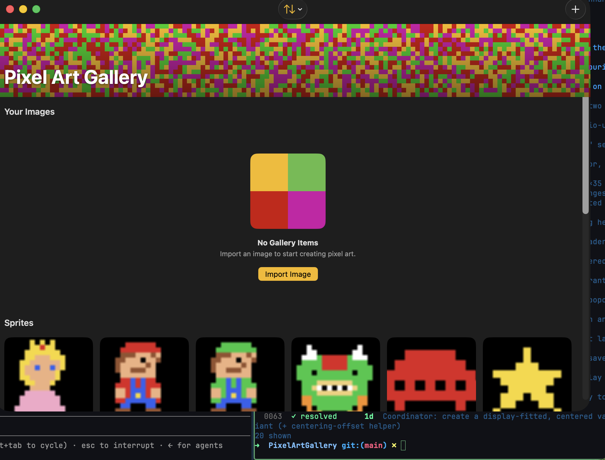

# 0080 — macOS: the gallery pixel banner bleeds under the window title bar and the toolbar controls overlap it (illegible)

| | |
|---|---|
| **Status** | resolved |
| **Module** | UI |
| **Platform** | macOS |
| **First seen** | 2026-07-12 |
| **Commit** | 7a2e548 |
| **Closed** | 2026-07-12 |

## Description

On macOS the vibrant pixel banner ([#0070](0070.md)) extends up **under the window title bar**, so the traffic-light buttons (top-left) and the toolbar controls — Sort (top-center) and the `+` add button (top-right, with a magenta halo from the pixels bleeding through) — sit directly **on top of the busy pixel pattern**, low-contrast and looking broken. The full-bleed collapsing banner is an iOS pattern (it fills under the iPhone status bar); macOS has a real title bar + toolbar and needs the header to sit **below** the title bar with a **legible toolbar**. This was only ever verified on iPhone — the Mac app was built but never run/observed.

## Plan

### Root cause

`GalleryBannerView` splits layout from render (#0072): the header's framed band stays inside the safe area, but its pixel background — `Color.clear.overlay { BackgroundPixelsView(style: .vibrant).frame(height: 220) }.clipped()` — gets `.ignoresSafeArea(edges: .top)` so the canvas bleeds up through the top safe area. On iPhone that safe area is the status bar (intended). On macOS, SwiftUI windows use a full-size content view, so the top safe area is the **title bar + toolbar** — the 220pt canvas paints straight up behind the traffic lights and the toolbar items. Compounding it, the `#if os(macOS)` toolbar in `GalleryListView` sets no toolbar background, so Sort and `+` float transparently on the busy pixels (see the attached screenshot).

### Approach (macOS-only; iPhone chrome untouched)

Chosen treatment: **on macOS the banner does NOT ignore the top safe area** — the header becomes a static, fully-expanded 128pt band that starts *below* the native title bar/toolbar, and the toolbar gets a visible background so `+`/Sort (and #0081's gear, once added) read on standard chrome. This is option (a) from the design points: a real Mac title bar above an intentional vibrant banner is the native look; keeping the bleed and just frosting the toolbar (option b) would still leave traffic lights on raw pixels.

**1. `PixelArtGalleryKit/Sources/PixelArtGalleryKit/UI/GalleryBannerView.swift` — gate the bleed to iOS.**
In the `.background(alignment: .top)` closure, make `.ignoresSafeArea(edges: .top)` iOS-only using a postfix `#if` (SE-0308, fine inside a ViewBuilder):

```swift
Color.clear
    .overlay(alignment: .top) {
        BackgroundPixelsView(style: .vibrant)
            .frame(height: 220) // expanded height (128) + generous status-bar allowance; constant.
    }
    .clipped()
#if os(iOS)
    .ignoresSafeArea(edges: .top)
#endif
```

Nothing else in the view changes: the 220pt canvas stays constant (the `BackgroundPixelsViewModel` regen guard still holds), `.clipped()` already crops it to the header's 128pt band on macOS, and the layout `frame(height:)`/scrim/title are shared. Update the comment above the `#if` to note the macOS behavior (no bleed; the header sits below the title bar, #0080).

**2. `PixelArtGalleryKit/Sources/PixelArtGalleryKit/UI/GalleryListView.swift` — legible macOS toolbar + static header.**

- Inside the existing `#if os(macOS)` block, immediately after the `.toolbar { ... }` closure, add:

  ```swift
  .toolbarBackground(.visible, for: .windowToolbar)
  ```

  This gives the window toolbar its standard material band even at rest, so the traffic lights, Sort, and `+` sit on native chrome (and content scrolled beneath the title bar is masked). `ToolbarPlacement.windowToolbar` is macOS-only and macOS 13+; the target is macOS 15. Keep the two existing `ToolbarItem`s (`+` `.primaryAction`, Sort `.secondaryAction`) exactly as they are — #0081 will add its gear `SettingsLink` alongside them; this modifier applies to the whole toolbar, so the gear inherits the legible background with no further work.
- **Collapse decision: static expanded header on macOS** (the #0072 reviewer's documented fallback). The collapse is an iOS large-title pattern; under a real Mac toolbar a shrinking banner reads as glitchy, and the macOS `onScrollGeometryChange` behavior has never been observed. `GalleryBannerView`'s own doc comment already anticipates this ("Pass the default `scrollOffset` of `0` for a static, fully-expanded header (… macOS)"). Gate at the call site:

  ```swift
  .overlay(alignment: .top) {
      #if os(macOS)
      // Static expanded header (#0080): macOS has a real title bar/toolbar
      // above the banner; no collapse. scrollOffset stays at its default 0.
      GalleryBannerView()
      #else
      GalleryBannerView(scrollOffset: headerScrollOffset)
      #endif
  }
  ```

  Also wrap the `.onScrollGeometryChange(for:)` modifier and the `headerScrollOffset` `@State` in `#if os(iOS)` so macOS doesn't churn dead state on every scroll frame (postfix `#if` on the modifier chain after `.contentMargins`).
- **No macOS variant needed for the body structure**: the single `ScrollView` + top overlay + `.contentMargins(.top, GalleryHeaderMetrics.expandedHeight, for: .scrollContent)` works unchanged — on macOS the constant margin matches the now-permanently-128pt header, content scrolls behind the opaque banner, and the visible toolbar background masks anything scrolling under the title bar. `Color.matteBackground.ignoresSafeArea()` (line 81) is benign on macOS (neutral matte under the title bar) — leave it.

**3. `PixelArtGallery/PixelArtGalleryApp.swift` — no change.** The standard `WindowGroup`/title bar is correct; the fix belongs in the shared views. (No `.windowStyle`/`.toolbarBackgroundVisibility` scene-level styling needed once the view-level `.toolbarBackground(.visible, for: .windowToolbar)` is in.)

**4. Other chrome checked** (grep for `ignoresSafeArea`/`toolbarBackground`): `DisplayRegistryView.swift:76` and `VariantDetailView.swift:112` use `.toolbarBackground(.hidden, for: .navigationBar)` but live in the Settings window and presented sheets/popovers, not the gallery window chrome — out of scope, leave alone. `GalleryBottomBar` is iOS-only. No other gallery-chrome sites need macOS handling.

### Verification

1. Package: `cd PixelArtGalleryKit && swift test` (no metrics change expected; existing `GalleryHeaderMetrics` tests must still pass).
2. Both platform builds:
   - `xcodebuild -project PixelArtGallery.xcodeproj -scheme PixelArtGallery -destination 'platform=macOS' build`
   - `xcodebuild -project PixelArtGallery.xcodeproj -scheme PixelArtGallery -destination 'platform=iOS Simulator,name=iPhone 17 Pro' build`
3. **Mandatory — the orchestrator launches the macOS app and screenshots the gallery** (this bug exists because macOS was built-but-never-run). In the screenshot(s), confirm:
   - The title bar/toolbar band is standard macOS material — traffic lights, Sort, and `+` on the toolbar background, **no pixels behind them**, no magenta halo around `+`.
   - The vibrant pixel banner is still present, full-width, starting **below** the toolbar, with "Pixel Art Gallery" bottom-left over the scrim — the banner is kept as an intentional element, not removed.
   - No bare/black seam between the toolbar and the banner, and none between the banner and the "Your Images" content (the #0072 black-bar regression).
   - After scrolling the grid: the header stays static (no collapse/jitter), content disappears cleanly behind the banner, and the toolbar remains legible with content scrolled beneath the title bar.
4. iPhone regression check: the iOS build plus a simulator screenshot (or at minimum code inspection confirming every change is inside `#if os(macOS)` gates / iOS-preserving `#if os(iOS)` gates) — status-bar bleed, collapsing header, and bottom bar unchanged.

## Notes

Relevant code:
- `PixelArtGalleryKit/Sources/PixelArtGalleryKit/UI/GalleryBannerView.swift` — the pixel background uses `.ignoresSafeArea(edges: .top)` (scoped to the background, `frame(height: 220)`). On iPhone the top safe area is the status bar (intended bleed); on macOS it's the **title bar**, so the pixels render behind the title bar/toolbar. This is the primary cause.
- `PixelArtGalleryKit/Sources/PixelArtGalleryKit/UI/GalleryListView.swift` — the macOS `#if os(macOS)` toolbar has `+` (`.primaryAction`) and Sort (`.secondaryAction`) with **no `.toolbarBackground`** (the `.toolbarBackground(.hidden)`/safe-area handling is all `#if os(iOS)`), so the toolbar is transparent over the banner. The #0072 collapsing header reads `onScrollGeometryChange` — its macOS behavior has never been observed (the #0072 reviewer flagged a possible macOS fallback: gate the header offset to a constant on macOS so it doesn't try to collapse under the title bar).
- `PixelArtGallery/PixelArtGalleryApp.swift` — a standard `WindowGroup` (normal macOS title bar; `.defaultSize(1000×700)`, `minWidth/Height`). No title-bar styling.

Design points (planner to finalize — this is a macOS-only fix; do NOT regress iPhone, which is correct):
- **Stop the banner bleeding under the title bar on macOS.** Options: (a) on macOS, do NOT `.ignoresSafeArea(edges: .top)` on the banner background so the header starts below the title bar; (b) or keep the pixel look but give the macOS toolbar a **legible background** (`.toolbarBackground(.visible, for: .windowToolbar)` / a solid or material bar) so the controls read; (c) or a macOS-specific header layout. Pick an approach that looks native on Mac and keeps the vibrant banner as an intentional element below the title bar, with the toolbar controls clearly legible. The planner should decide the cleanest treatment.
- **Toolbar legibility/placement** on macOS: the `+` and Sort must be clearly visible and sensibly placed (not floating mid-title-bar over pixels). Consider a standard toolbar with a background rather than transparent-over-banner.
- **Collapsing header on macOS**: confirm/adjust the #0072 `onScrollGeometryChange`-driven collapse on macOS — if it misbehaves, gate `scrollOffset` to a constant (static expanded header) on macOS per the #0072 reviewer's documented fallback.
- Shared views; `#if os(macOS)` for the macOS-specific treatment only; keep the iPhone chrome (banner + collapse + bottom bar) exactly as-is.

Verification: both platform `xcodebuild` builds; and — **mandatory this time** — actually **launch the macOS app** and screenshot the gallery to confirm the title bar/toolbar no longer overlaps the banner, the controls are legible, and scrolling behaves. (This whole class of bug exists because macOS was built-but-never-run; the fix isn't done until the Mac app is observed.)

## Resolution notes

> 🟢 Resolved 2026-07-12 — On macOS the banner no longer bleeds under the title bar: `.ignoresSafeArea(edges: .top)` is now `#if os(iOS)`-only, the window toolbar gets `.toolbarBackground(.visible, for: .windowToolbar)`, and the header is static (the `onScrollGeometryChange` observer + `headerScrollOffset` state are iOS-gated). Every change is `#if os` guarded, so iOS is byte-identical — the iPhone status-bar bleed, collapsing header (#0072), and bottom bar are untouched. Visually confirmed by launching the Mac app: the title bar is a solid material band with the traffic lights, Sort, and `+` legible on it, and the vibrant banner sits below the toolbar with no bleed/overlap/halo. `swift test` 235 tests/29 suites pass; both macOS and iOS builds succeed. Commit `7a2e548`.

## Root cause

`GalleryBannerView`'s background canvas applied `.ignoresSafeArea(edges: .top)` unconditionally to the 220pt vibrant pixel canvas (`.clipped()` to the header's 128pt band, then bled up). On iPhone the top safe area is the status bar, so the bleed is the intended full-bleed look (#0070/#0072). On macOS a `WindowGroup`'s top safe area is the title bar/toolbar, so the same canvas painted straight up behind the traffic lights and the toolbar. Compounding it, `GalleryListView`'s `#if os(macOS)` toolbar had no `.toolbarBackground`, so it stayed transparent over the busy pixel pattern — the `+` button picked up a magenta halo and Sort was low-contrast. The #0072 collapsing header (`onScrollGeometryChange` driving `headerScrollOffset`) had also never been exercised on macOS.

## Fix

Implemented exactly per the plan, no deviations:

- **`GalleryBannerView.swift`**: gated `.ignoresSafeArea(edges: .top)` behind a postfix `#if os(iOS) ... #endif` inside the `.background(alignment: .top)` closure. macOS now leaves the canvas un-bled — it's still `.clipped()` to the header's current 128pt band, so it sits entirely below the title bar/toolbar instead of behind it. Updated the adjacent comment to explain both platforms' safe-area meaning and reference #0080. Nothing else in the view changed — same 220pt constant canvas, same layout `frame(height:)`/scrim/title.
- **`GalleryListView.swift`**:
  - Added `.toolbarBackground(.visible, for: .windowToolbar)` inside the existing `#if os(macOS)` block, immediately after the `.toolbar { ... }` closure, so the window toolbar always shows its standard material band — traffic lights, Sort, and `+` now read on native chrome, and anything scrolled beneath the title bar is masked. The two existing `ToolbarItem`s (`+` primary action, Sort secondary action) are untouched; #0081's future gear will inherit the same background.
  - Made the header static (no collapse) on macOS: at the `.overlay(alignment: .top)` call site, `#if os(macOS)` now renders `GalleryBannerView()` (default `scrollOffset: 0`) while `#else` keeps the iOS collapsing `GalleryBannerView(scrollOffset: headerScrollOffset)`. Wrapped both the `.onScrollGeometryChange(for:)` modifier and the `headerScrollOffset` `@State` declaration in `#if os(iOS)` so macOS never runs the scroll observer or churns dead state on every frame.
  - Left `.contentMargins(.top, GalleryHeaderMetrics.expandedHeight, for: .scrollContent)` and `Color.matteBackground.ignoresSafeArea()` untouched, per the plan — both work as-is for the static 128pt macOS header.
- **`PixelArtGalleryApp.swift`**: no change, as planned.
- Did not touch `DisplayRegistryView`/`VariantDetailView` (`.toolbarBackground(.hidden, for: .navigationBar)`) — out of scope, Settings/sheets rather than gallery window chrome.

## Verification

1. `cd PixelArtGalleryKit && swift test` — **235 tests, 29 suites, all passed** (`Test run with 235 tests in 29 suites passed after 0.241 seconds`), including the existing `GalleryHeaderMetrics`-covered suites; no logic/metrics change so no new failures expected or seen.
2. `xcodebuild -project PixelArtGallery.xcodeproj -scheme PixelArtGallery -destination 'platform=macOS' build` — **BUILD SUCCEEDED**.
3. `xcodebuild -project PixelArtGallery.xcodeproj -scheme PixelArtGallery -destination 'platform=iOS Simulator,name=iPhone 17 Pro' build` — **BUILD SUCCEEDED**.
4. **Pending — not run by this subagent**: the mandatory visual confirmation (launch the macOS app, screenshot the gallery, confirm no pixels/halo behind the traffic lights/Sort/`+`, banner starts below the toolbar, no black seam, and the header stays static/non-jittery while scrolling). Per this issue's own verification plan and the phase-2 procedure, the orchestrator performs this launch-and-screenshot gate next; every changed line is `#if os` guarded (`#if os(iOS)` / `#if os(macOS)`) so the iPhone chrome (status-bar bleed, collapsing header, bottom bar) should be byte-identical, but that has not yet been independently observed via simulator screenshot either.

## Files changed

- `PixelArtGalleryKit/Sources/PixelArtGalleryKit/UI/GalleryBannerView.swift` — gated the bleeding `.ignoresSafeArea(edges: .top)` to `#if os(iOS)`; updated the adjacent comment.
- `PixelArtGalleryKit/Sources/PixelArtGalleryKit/UI/GalleryListView.swift` — added `.toolbarBackground(.visible, for: .windowToolbar)` to the macOS toolbar; made the header overlay static on macOS (`GalleryBannerView()` vs. `GalleryBannerView(scrollOffset: headerScrollOffset)`); gated `.onScrollGeometryChange` and the `headerScrollOffset` `@State` to `#if os(iOS)`.

## Gotchas

- The `## Verification` section above is honest that the mandatory launch-and-screenshot gate (item 3 in this issue's own `### Verification` under `## Plan`) has **not** been performed by this implementation pass — both builds are green and every change is platform-gated, but the visual confirmation on macOS (and the iOS simulator regression screenshot) is the orchestrator's next step before this can be considered resolved.

## Attachments


## Relation

- Refines the gallery chrome ([#0069](0069.md)/[#0070](0070.md)/[#0071](0071.md)/[#0072](0072.md)) for macOS specifically. First of a set of macOS-app fixes (more to be filed).

## Work log

| Date | Phase | Model | Input | Output | Cache read | Cache write | Cost |
|---|---|---|---|---|---|---|---|
| 2026-07-12 | plan | claude-fable-5 | 7,407 | 465 | 165,854 | 52,655 | $0.92 |
| 2026-07-12 | implement | claude-sonnet-5 | 36 | 1,667 | 998,533 | 80,762 | $0.42 |

**Total: $1.34**

## Verification screenshot (macOS app, after)

Launched the macOS app: the title bar is now a solid material band with the traffic lights, Sort, and `+` legible on it; the vibrant pixel banner sits **below** the toolbar (no bleed, no overlap, no magenta halo). Compare to `0080/macos-banner-overlap.png` (before).


