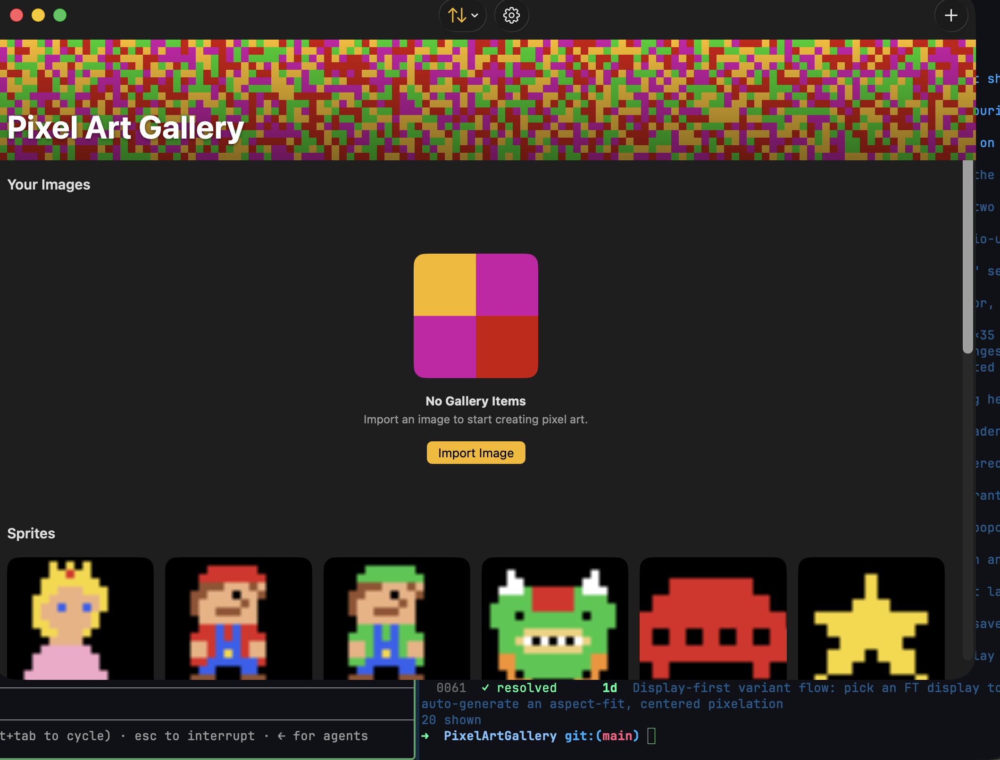

# 0082 — macOS: make the window toolbar opaque (content shows through the translucent title bar)

| | |
|---|---|
| **Status** | in-progress |
| **Module** | UI |
| **Platform** | macOS |
| **First seen** | 2026-07-12 |
| **Commit** | 8640d0a |

## Description

After [#0080](0080.md) gave the macOS toolbar a visible background (`.toolbarBackground(.visible, for: .windowToolbar)`), it uses the standard **translucent** macOS toolbar material — so content/the vibrant banner shows through the title bar (with the traffic-light buttons), which looks odd. Make the macOS window toolbar **opaque** so nothing shows through behind the title bar.

## Root cause

`.toolbarBackground(.visible, for: .windowToolbar)` (added by #0080) accepts `ShapeStyle.visible`, which asks SwiftUI to render the toolbar with the **standard system toolbar material** — the same translucent/vibrant material macOS windows normally use — rather than an opaque fill. That material is intentionally translucent, so the vibrant pixel-art banner (and anything scrolled beneath it) showed through the title bar behind the traffic lights, which read as visually broken rather than a deliberate design choice.

## Fix

Passed an opaque `ShapeStyle` to `.toolbarBackground(_:for:)` instead of `.visible`: `.toolbarBackground(Color.matteBackground, for: .windowToolbar)`. `Color.matteBackground` (`PixelArtGalleryKit/Sources/PixelArtGalleryKit/UI/Palette.swift`) resolves to `Color(nsColor: .windowBackgroundColor)` on macOS — opaque, and it automatically follows light/dark mode, matching the matte used behind the gallery grid/empty state. This is a one-line, macOS-only change inside the existing `#if os(macOS)` block; no other toolbar behavior changed. The banner-below-toolbar / static-header layout from #0080 is untouched. Followed the plan in `## Notes` exactly (no divergence).

## Verification

- `cd PixelArtGalleryKit && swift test` — full package suite ran and passed: **235 tests in 29 suites**, no failures (no logic touched by this UI-only styling change).
- `xcodebuild -project PixelArtGallery.xcodeproj -scheme PixelArtGallery -destination 'platform=macOS' build` — **BUILD SUCCEEDED**.
- `xcodebuild -project PixelArtGallery.xcodeproj -scheme PixelArtGallery -destination 'platform=iOS Simulator,name=iPhone 17 Pro' build` — **BUILD SUCCEEDED** (iOS is untouched; this build confirms the macOS-only `#if` guard didn't regress the iOS target).
- **Pending gate:** the actual visual confirmation — launching the macOS app and observing that the title bar is now opaque (no banner/content bleeding through behind the traffic lights) while Sort/`+`/the gear stay legible — is an orchestrator/device step not run in this pass; both builds are green and the code change matches the plan's recommended approach.

## Files changed

- `PixelArtGalleryKit/Sources/PixelArtGalleryKit/UI/GalleryListView.swift` — swapped `.toolbarBackground(.visible, for: .windowToolbar)` for `.toolbarBackground(Color.matteBackground, for: .windowToolbar)` and updated the adjacent comment to describe the opaque behavior; macOS-only (`#if os(macOS)`).

## Notes

Relevant code:
- `PixelArtGalleryKit/Sources/PixelArtGalleryKit/UI/GalleryListView.swift` — the `#if os(macOS)` block has `.toolbarBackground(.visible, for: .windowToolbar)` (from #0080). `.visible` renders the system toolbar material, which is translucent/vibrant. To make it opaque, pass an **opaque `ShapeStyle`** to `.toolbarBackground(_:for:)` instead — e.g. `.toolbarBackground(Color.matteBackground, for: .windowToolbar)` (the app's system matte, `Color(nsColor: .windowBackgroundColor)` on macOS, from #0070) so the bar is solid and matches the content area, with the vibrant banner starting below it.
- `PixelArtGalleryKit/Sources/PixelArtGalleryKit/UI/Palette.swift` — `Color.matteBackground` (opaque, follows light/dark).

Design points (planner/implementer to finalize — macOS-only; do NOT touch iOS):
- Replace `.toolbarBackground(.visible, for: .windowToolbar)` with an **opaque** background: recommend `.toolbarBackground(Color.matteBackground, for: .windowToolbar)` so the title bar is solid and blends with the content matte (dark bar in dark mode, light in light) while keeping the traffic lights / Sort / `+` (and #0081's gear) legible. If a plain matte reads as too flat, an alternative is an opaque solid tuned to the toolbar; keep it simple and opaque. Confirm content no longer shows through the title bar.
- Keep the banner-below-the-toolbar layout and static header from #0080 unchanged. This is only the toolbar's translucency → opacity.
- Everything stays inside `#if os(macOS)`; iOS is untouched.

Verification: macOS + iOS `xcodebuild` builds; and **launch the macOS app** to confirm the title bar is opaque (no content/banner bleeding through behind the traffic lights) while the controls stay legible. Screenshot.

## Relation

- Refines [#0080](0080.md) (which added the visible-but-translucent macOS toolbar background). Pairs with [#0081](0081.md) (the gear joins the same toolbar). Part of the macOS-app fixes set.

## Work log

| Date | Phase | Model | Input | Output | Cache read | Cache write | Cost |
|---|---|---|---|---|---|---|---|
| 2026-07-12 | plan | (in issue Notes) | — | — | — | — | — |
| 2026-07-12 | implement (combined #0081+#0082) | claude-sonnet-5 | 44 | 1,001 | 1,048,471 | 69,345 | $0.39 |

**Total: $0.39**

## Verification screenshot (macOS app)

Launched the macOS app: the title bar is now a **solid opaque** band (no banner/content bleeding through behind the traffic lights); Sort, the gear, and `+` stay legible; the vibrant banner sits below.

