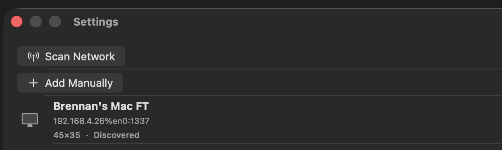

# 0083 — macOS: an extra circle (Liquid-Glass capsule) rings the "+" add control in the Settings window

| | |
|---|---|
| **Status** | resolved |
| **Module** | UI |
| **Platform** | macOS |
| **First seen** | 2026-07-12 |
| **Commit** | 5b6fde0 |
| **Closed** | 2026-07-12 |

## Description

In the macOS Settings window (display management, `DisplayRegistryView`), the "+" add-display pull-down had a distracting **extra circular ring** around it. On macOS 26 (Liquid Glass), the Settings *scene* wraps every toolbar control in a prominent glass capsule, so the lone "+" read as a stray circle floating under the "Settings" title. Fixed by moving the Scan/Add actions out of the Settings-scene toolbar and into the list body as labeled buttons (iOS keeps its nav-bar "+" menu).

## Resolution notes

> 🟢 Resolved 2026-07-12 — The "+" pull-down was the sole item in the macOS Settings-scene toolbar, and macOS 26's Settings scene renders every toolbar control inside a prominent Liquid-Glass capsule — the stray ring. Empirically confirmed on the running Mac app that the capsule is inherent to the Settings scene's toolbar (it persisted for a Menu, for one or two plain Buttons, at `.primaryAction` and `.secondaryAction`, and with an opaque `.toolbarBackground`). The fix takes the actions out of that toolbar: on macOS, "Scan Network" and "Add Manually" are now labeled buttons at the top of the display list (`addDisplaySection`); iOS is byte-for-byte unchanged (it keeps the nav-bar "+" pull-down menu). Verified live with before/after screenshots — the ring is gone. Both platform builds are green and all 235 package tests pass.

## Root cause

macOS 26 (Liquid Glass) draws a glass "capsule" background behind toolbar item groups. In the ordinary gallery *window* toolbar this is faint (a barely-visible outline over the opaque matte, and the lone trailing `+` shows none), so it never read as a defect. But `DisplayRegistryView` is hosted in a `Settings` **scene** (`SettingsView` → macOS `Settings` window), and the Settings scene renders its toolbar controls in a **prominent, centered** glass capsule. With a single "+" pull-down as the only toolbar item, that capsule looked like a stray circle drawn around the icon.

The behavior was verified to be scene-inherent, not caused by any one attribute, by iterating on the running Mac app:

- `Menu { … } label: { Image("plus") }` → prominent circle.
- `.menuStyle(.borderlessButton)` on the Menu → no change.
- Two plain `Button`s (Scan + Add) → still one capsule around the pair.
- `.primaryAction` vs `.secondaryAction` placement → still a prominent capsule (unlike the gallery window's faint one).
- A single plain `Button` → still a capsule.
- Adding `.toolbarBackground(Color.matteBackground, for: .windowToolbar)` (the #0082 gallery treatment) → no change.

The only reliably capsule-free surface is the view **body**, which is also where the empty-state already puts these actions (`DisplayEmptyStateView`, #0067).

## Fix

`PixelArtGalleryKit/Sources/PixelArtGalleryKit/UI/DisplayRegistryView.swift`:

- **macOS:** removed the toolbar item entirely and added a new `addDisplaySection` — a `Section` at the top of the display `List` with two labeled buttons, **Scan Network** (antenna icon; shows an inline "Scanning…" spinner while a scan runs) and **Add Manually** (plus icon). These render as ordinary body controls with no toolbar capsule, and are more discoverable than a lone icon (in line with #0081's goal of surfacing display management).
- **iOS:** unchanged — the `.toolbar` with the `+` pull-down `Menu` (Scan Network / Add Manually) is now gated `#if os(iOS)`, byte-for-byte identical to before. The nav-bar `+` is the idiomatic iOS pattern and never showed the macOS capsule.
- The empty-state path (`DisplayEmptyStateView`) already offered Scan/Add as body buttons on both platforms, so it needed no change and stays consistent with the new non-empty layout.

No logic changed — this is a UI-placement change guarded by `#if os(macOS)` / `#if os(iOS)`.

## Verification

- Reproduced and fixed on the **running macOS app** (macOS 26.4.1): launched, opened Settings (⌘,), and screenshotted before and after. Before: a prominent circle around the "+". After: no circle — Scan Network / Add Manually as labeled buttons atop the list (screenshots below).
- `xcodebuild … -destination 'platform=macOS' build` — **BUILD SUCCEEDED**.
- `xcodebuild … -destination 'platform=iOS Simulator,name=iPhone 17 Pro' build` — **BUILD SUCCEEDED** (confirms the `#if os(iOS)` toolbar / `#if os(macOS)` body split compiles for both targets).
- `cd PixelArtGalleryKit && swift test` — **235 tests / 29 suites pass** (no logic touched).

## Files changed

- `PixelArtGalleryKit/Sources/PixelArtGalleryKit/UI/DisplayRegistryView.swift` — macOS: added `addDisplaySection` (body Scan/Add buttons) and inserted it into the `List`; removed the shared `.toolbar`; re-added the original `+` pull-down `Menu` gated `#if os(iOS)`.

## Relation

- Part of the macOS-app fixes set: [#0080](0080.md) (banner/title-bar layout), [#0081](0081.md) (Settings gear + display management discoverability), [#0082](0082.md) (opaque toolbar). This removes the last stray chrome artifact — the Settings-scene toolbar capsule around the add control.
- Reuses the body-button pattern established by [#0067](0067.md)'s `DisplayEmptyStateView`.

## Before / After (macOS app)

Before — the "+" pull-down ringed by the Liquid-Glass capsule:

After — Scan Network / Add Manually as labeled body buttons, no ring:

## Work log

| Date | Phase | Model | Input | Output | Cache read | Cache write | Cost |
|---|---|---|---|---|---|---|---|
| 2026-07-12 | investigate + implement + verify (in orchestrator — required live macOS-26 render iteration a subagent can't do) | claude-opus-4-8 | — | — | — | — | — |
